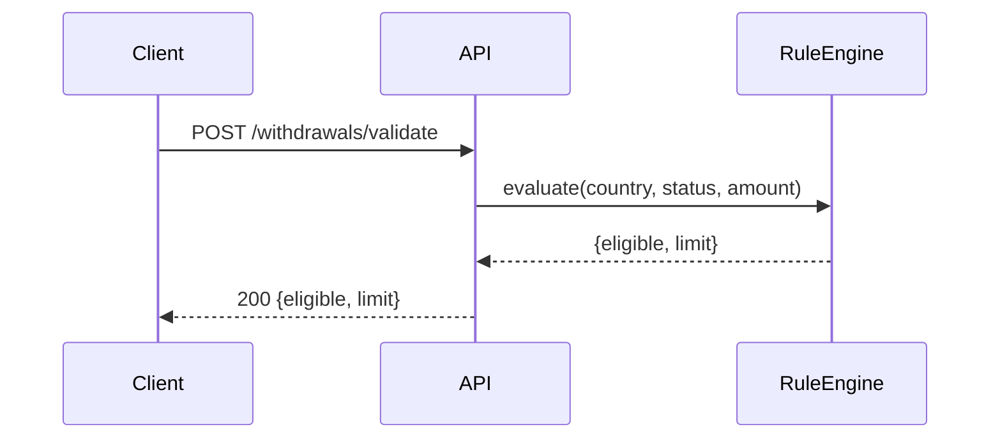

# Writing Guide

How to phrase a design doc so a reviewer can act on it quickly.

## Front-load the answer

Every section starts with its conclusion; supporting detail follows. Reviewers read the first sentence of each section and skim the rest until something surprises them. If your conclusion is in the last paragraph, it doesn't exist.

Bad: "We looked at several options for where to enforce limits, and after considering client-side validation, a shared library, and a backend rule engine…"
Good: "Limits will be enforced server-side in a new rule engine. We considered a shared client library, but it can't guarantee consistency across release cadences."

## Say why, not just what

The what is checkable from the diff. The why is the only thing a design doc uniquely carries.

Weak: "Add a `POST /withdrawals/validate` endpoint."
Strong: "Add `POST /withdrawals/validate` so the client can render the correct limit without duplicating the rule — the same rule the submit path enforces."

Every "we will add X" should survive the question *why X and not the obvious simpler thing?*

## Prefer tables and pseudocode for anything conditional

Prose is where ambiguity hides. The moment behaviour depends on two variables, a table forces you to fill in the cell you were avoiding — and reviewers read tables completely while skimming paragraphs.

## Mark NEW and MODIFIED

In every diagram and every change table. It's the single highest-signal thing you can do, because "what's changing" is the reviewer's first question and this answers it visually.

```text
                    ┌── POST /withdrawals/validate  [NEW]
                    │
Frontend ───────────┤
                    │
                    ↓
             Withdrawal Service  [MODIFIED]
                    │
          ┌─────────┼─────────┐
          ↓         ↓         ↓
     Rule Engine  Payment   Database
        [NEW]     Service
```

Keep the diagram to the path this change touches. A complete system diagram buries the change inside things that aren't changing.

Use Mermaid when the target renders it, or when the flow is sequential enough that a `sequenceDiagram` beats boxes:

````markdown

````

Follow every diagram with one sentence naming the design intent. The boxes support the sentence, not the other way round.

## Be concrete about where things live

Name files, services, endpoints, tables. A doc that says "the backend will handle validation" hasn't been thought through; one that says "`WithdrawalValidator.validate()` is called by `WithdrawalService` before the payment call" has. Concreteness is also self-checking: you can't name the file without reading the code.

## Don't fabricate

Never invent an endpoint shape, schema, error code, or metric to make a section look complete. If you don't know, either read the code or record it as an assumption in Open Questions. A confident wrong detail wastes more review time than an honest gap — and one caught fabrication makes a reviewer distrust the whole document.

## Own the judgment, then ask

An architect review isn't "I already designed everything, approve it". It's:

> Here's my understanding. Here's my proposed solution. Here are the alternatives I considered. Here are the risks I found. And here's what I need you to decide.

State a recommendation even when you're unsure — then put the uncertainty in Open Questions. A doc with no recommendation makes the reviewer do your job; a doc with no open questions makes them hunt for what you missed.

## Length discipline

Cut a section when its content is "N/A", when it restates another section, or when it's true of every change your team ships. A 3-page doc that's fully read beats a 12-page doc that's skimmed to section 4.

When the doc gets long anyway (genuinely complex change), add a 5-line summary at the top: what's changing, why, the one design decision, the one biggest risk.

## English phrasing patterns

Useful when English isn't your first language. These read as natural technical register.

**Framing a problem**
- "Today, X is handled by Y, which means Z."
- "This becomes a problem when …"
- "The current design assumes …, which no longer holds because …"

**Proposing**
- "We propose to …"
- "The proposed design introduces … so that …"
- "This moves responsibility for X from A to B."

**Trade-offs**
- "The main trade-off is … in exchange for …"
- "We accept … because …"
- "This adds … but removes the need for …"

**Recommending**
- "We recommend Option B, because withdrawal rules are regulatory and consistency outweighs the additional API work."
- "Either option is workable; we lean towards A on maintenance cost."

**Risk**
- "The main risk is that …; we mitigate this by …"
- "This is safe to roll back until the migration runs; after that, we would need a forward fix."

**Asking for a decision**
- "We would like the architect to confirm whether …"
- "This is blocking: we need a decision on … before implementation starts."
- "Our proposed default is X unless there's a reason to prefer Y."

Prefer present tense for current behaviour, future for proposed. Prefer "we" over passive voice — passive hides who is responsible, which is exactly what a reviewer is trying to establish.
