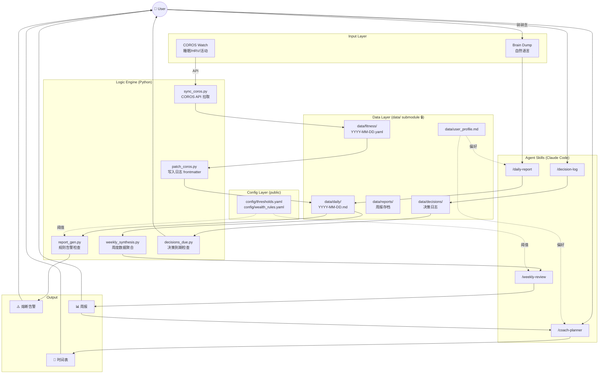
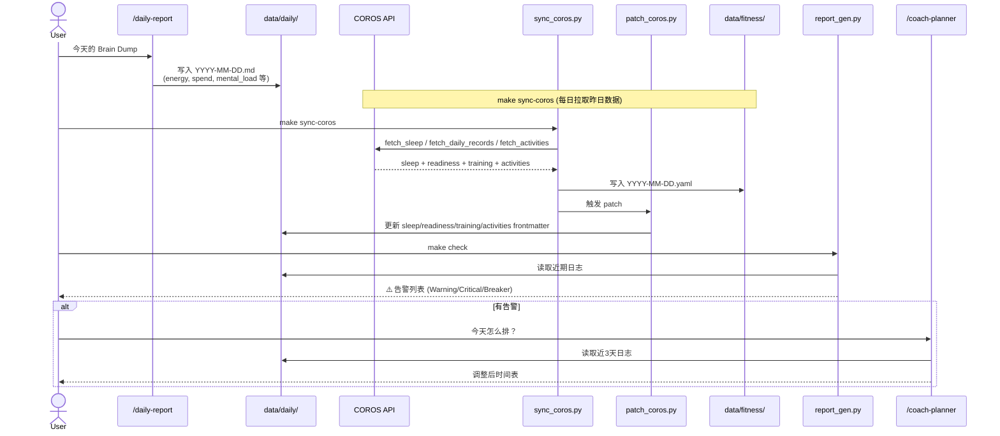
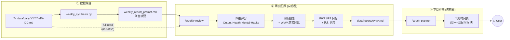
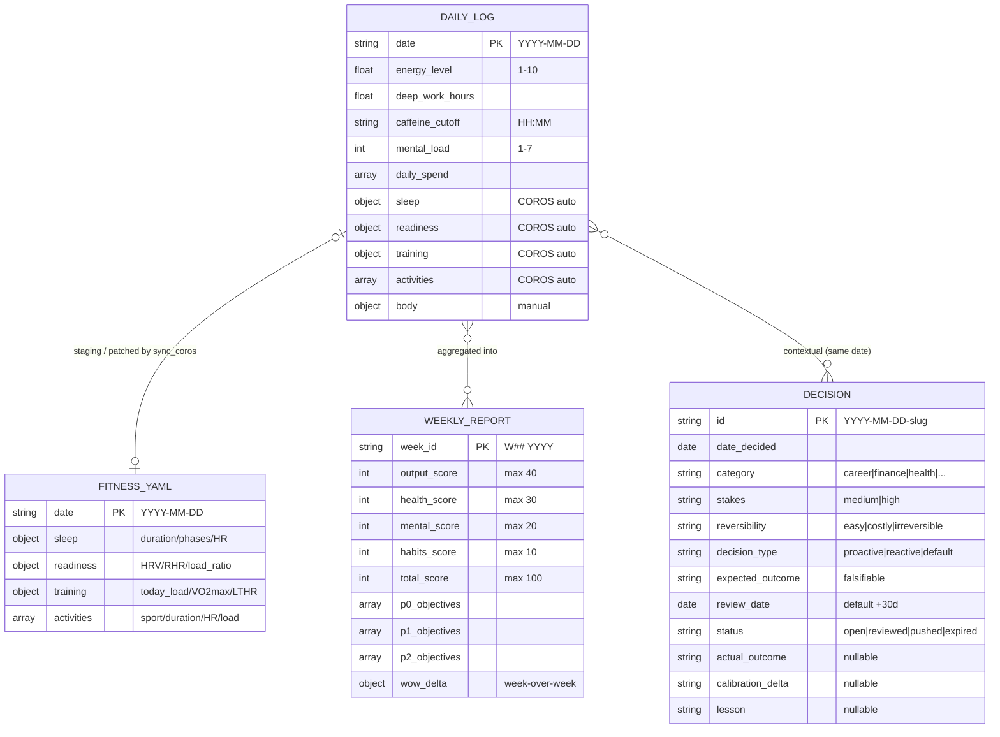
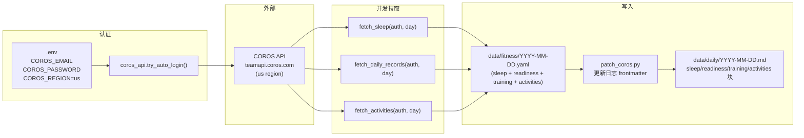
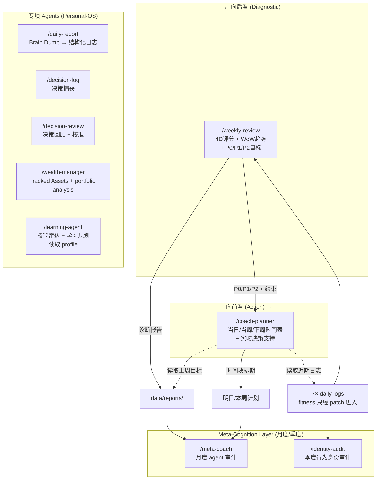
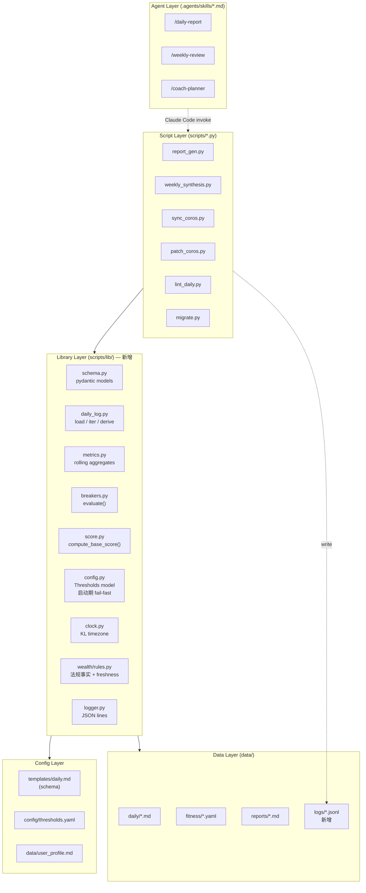

# Personal-OS — Architecture

Personal-OS 是单用户本地的数据驱动自我管理系统。核心闭环：每日 Brain Dump + COROS 自动同步构成结构化日志 → 逻辑引擎扫描触发熔断告警 → 周日聚合分析产出四维评分和诊断 → coach-planner 基于诊断排下周时间表。

**设计原则**：
- **人类可读优先** —— Markdown + YAML 作为存储介质，拒绝 SQLite/DB，保 `cat` + `grep` + 手改的工作流
- **职责分层** —— AI 负责 flexible narrative（评分解读、blocker 根因、排期叙事），代码负责 deterministic metrics（阈值判定、聚合、熔断）
- **本地单用户** —— 不做后台 cron / 托管部署 / 多租户；COROS 拉取与 Calendar 推送是用户显式运行的集成命令
- **失败友好** —— 缺数据跳过而非崩溃；任何一天的日志残缺不影响其他天聚合

---

## 1. System Overview

> 说明：本架构图聚焦 Personal-OS 核心数据闭环。独立的专项 agent（wealth-manager 只读 `data/finance/` 并产出 Tracked Assets 报告；learning-agent 读取 profile、写入市场资料/报告）见 §7。

---

## 2. Daily Loop

每天的核心数据闭环：Brain Dump 结构化 + COROS 自动填充 + 逻辑引擎告警。

---

## 3. Weekly Loop

每周日的回顾与下周排期双循环。

> `/weekly-review` 除了读 `weekly_report_prompt.md` 的聚合摘要外，**还会直接通读 7 天 daily log**（SKILL.md Step 1.3），以捕捉 highlights / blockers / 营养等 narrative 上下文。`data/fitness/*.yaml` 只是 COROS staging buffer，先由 `patch_coros.py` 合并进 daily frontmatter，不是周聚合的第二输入。

---

## 4. Data Layer

仅列出核心闭环中的 persisted entities。配置（`config/thresholds.yaml`、`config/wealth_rules.yaml`、`data/user_profile.md`）和专项 agent 数据（`data/finance/`）不在此图。

---

## 5. COROS Sync Pipeline

### 设计 tradeoff：fitness.yaml ↔ daily.md 双写

`data/fitness/*.yaml` 与 `data/daily/*.md` 的 `sleep / readiness / training / activities` 四块**故意双写**（`patch_coros.py` 的存在即为此）。这是经过评估后的选择：

| 方案 | 优点 | 缺点 | 决策 |
|------|------|------|------|
| **当前：yaml → patch → md（双写）** | daily.md 自包含，`cat 2026-04-22.md` 可见全部当日数据；grep 查询无需 join | COROS 数据两处存储，有 stale-copy 风险（用户手改 md 的 sleep 块会在下次 sync 被覆盖） | ✅ 采用 |
| 替代：yaml 独占，md 只存 ref 指针，聚合时 join | 无双写；用户手改 md 不丢失 | daily.md 不再自包含；所有聚合 / 查询需 on-read merge；损失 grep 工作流 | ❌ 拒绝（见 `docs/DECISIONS.md` §1 第 11 条） |

**用户契约**（与 §8.2 对齐）：`sleep.* / readiness.* / training.* / activities[]` 在 daily.md 中对**所有非 `patch_coros.py` 的 writer 只读**；若需手动修正，改 `data/fitness/*.yaml` 后重跑 `make sync-coros DATE=YYYY-MM-DD`，否则下次 sync 会覆盖。

---

## 6. Circuit Breakers

`report_gen.py` 独立遍历 `config/thresholds.yaml` 的 `circuit_breakers` 列表，按 metric + operator 匹配最近日志逐条判定 —— **没有显式 state machine**，每个 breaker 是独立规则，可同时触发多条。

| Breaker | Metric | Condition | 主要约束 (节选) |
|---------|--------|-----------|----------------|
| Sleep Critical | `sleep_duration` | `< 6.5h` (同 `sleep.poor_sleep_duration_hours`，仅时长) | 禁晨跑；禁大重量；DW cap 4h；22:00 强制断电 |
| Sleep Debt L1 | `rolling_7d_sleep_debt` | `>= 5.0` | 跑步降级 Z2 (≤ 145bpm, 30min)；训练降重 30% |
| Sleep Debt L2 | `rolling_7d_sleep_debt` | `> 8.0` | 禁跑步，仅低心率快走；训练降重 50%；周末零产出 |
| Energy Collapse | `energy_level` | `< 4` | 取消当日全部训练；DW cap 2h；21:30 断电 |
| Mental Overload | `mental_load` | `>= 7` | 单任务模式；禁额外会议/社交；2h 强制 15min 呼吸间隔 |
| Consecutive Poor Sleep | `consecutive_poor_sleep` | `>= 2` | 次日 System Offline；咖啡因窗口 10:00 前；DW cap 3h |
| HRV Recovery Alert | `hrv` | `< 30ms` | 禁高强度；强制午休 20-30min；22:00 强制断电 |
| Spending Surge | `single_transaction` | `> RM 30` | 日志记录消费理由；剩余天数自炊率 ≥ 95% |
| Overtraining Warning | `load_ratio` | `> 1.5` | 禁额外训练；下次训练降重 30%；强制 8h 睡眠窗口 |

完整 `actions` 列表见 `config/thresholds.yaml` 的 `circuit_breakers` 块。

**Null-safe 判定**：`report_gen.py` 与 `weekly_synthesis.py` 在 `actual is None` 时**跳过该 breaker**（而非 default 0），避免缺数据日（尤其 HRV 未同步时）产生 false positive。

**Poor Sleep derivation**（Option P-d，替代已删的 `sleep.quality`）：`duration < sleep.poor_sleep_duration_hours` **或** `(awake_min > sleep.awake_min_warning AND hrv < hrv_baseline × sleep.poor_sleep_hrv_ratio)`，唯一实现为 `scripts/lib/daily_log.py::derive_poor_sleep`。`single_transaction` 是最新日志当天的最大已记录消费；新的一天没有消费证据时不会沿用旧日大额消费。

---

## 7. Agent Skill Responsibilities

> Claude Code 的通用 skill（`/git-commit`、`/skill-creator`、`/review` 等）不属于 Personal-OS 系统组件，故不列入本图。

---

## 8. Invariants & Contracts

系统的一致性靠以下**隐性契约**维持。显式列出来便于 review、debug、未来演进。

### 8.1 Schema 所有权

- `scripts/lib/schema.py::DailyLog` 是 daily frontmatter 的 executable schema；`templates/daily.md` 是人类填写模板，必须保持字段 parity（`tests/test_smoke.py` 守护）
- 任何未在 Pydantic model 中声明的顶级 key 视为未知（`make lint` 会拒绝）；模板中的可选字段可以为空
- `config/thresholds.yaml` 是所有阈值 + breaker 规则的唯一来源；脚本内禁止硬编码数字
- `data/user_profile.md` 是作息 / 饮食 / 训练偏好的唯一来源；skill 评分或排期涉及偏好时必须读这里
- `config/wealth_rules.yaml` 是外部法规事实的唯一来源；`scripts/lib/wealth/rules.py` 负责校验并把 freshness health 传给 CLI/web

### 8.2 字段写入所有权

| Field | 写入方 | 冲突规则 |
|-------|--------|----------|
| `sleep.*` / `readiness.*` / `training.*` / `activities[]` | `patch_coros.py` 独占 | 用户手改会在下次 `make sync-coros` 被覆盖（见 §5 tradeoff） |
| `energy_level` / `mental_load` / `deep_work_hours` / `caffeine_cutoff` / `primary_blocker` / `daily_spend` | `/daily-report` skill 或用户手编 | 后写覆盖；skill 遵守"合并不覆盖"（`daily-report/SKILL.md:58`） |
| 正文 Highlights / Blockers / Next Steps / Nutrition | `/daily-report` skill 或用户手编 | 同上 |
| `body.*` | 用户手编**独占** | 任何脚本 / skill 不写（per `feedback-body-data-manual`） |

### 8.3 读契约

| 组件 | 读取内容 |
|------|---------|
| `report_gen.py` | 所有 `daily/*.md` frontmatter；**忽略正文** |
| `weekly_synthesis.py` | 本周 frontmatter + 正文前 500 字符（Token 预算） |
| `/weekly-review` | 本周 frontmatter + **完整正文** + `weekly_report_prompt.md` + 上周 report |
| `/coach-planner` | 最近 3 天 frontmatter + 完整正文 + `data/user_profile.md` + 上周 report |
| `/daily-report` | `templates/daily.md` + `data/user_profile.md` + （若存在）当日现有 daily.md（合并模式） |
| `decisions_due.py` | `data/decisions/*.md` frontmatter only（status + review_date） |
| `/decision-log` | `templates/decision.md`（schema）+ brain dump input |
| `/decision-review` | `data/decisions/*.md` 完整内容（frontmatter + body） |
| `calibration.py` | `data/decisions/*.md` frontmatter（confidence + calibration_delta） |
| `/meta-coach` | 最近 4 周 weekly reports + timetables + daily logs；不读 decisions |
| `/identity-audit` | 一季度 daily logs + weekly reports + `data/user_profile.md` + decisions（category 分布） |

### 8.4 Breaker 评估不变式

- **无状态**：每次 run 独立从日志重新 derive 所有 `latest_metrics`；不保留跨 run 状态
- **无级联 / 无优先级**：多个 breaker 独立并行评估，同一 run 可同时 trip 多条
- **Null-safe**（post-Wave 1）：`actual is None` → 跳过该 breaker；避免缺数据 default 0 产生 false positive
- **Poor Sleep derivation**（Option P-d）：阈值从 `config/thresholds.yaml::sleep` 读取；在 `scripts/lib/daily_log.py::derive_poor_sleep` 单一实现
- **Spending Surge**：只看最新日志当天的最大 `daily_spend.amount`；缺少当天消费证据时不从历史日志借值

### 8.5 时间 / 周界契约

- daily.md 日期 = 吉隆坡本地日期；Python 统一经过 `scripts/lib/clock.py`，Makefile 也显式设置 `TZ=Asia/Kuala_Lumpur`
- 周界 = ISO week（周一起，周日止）
- `make sync-coros` 默认拉取 `today − 1`（昨日数据早晨才完整同步到 COROS 云端）
- `rolling_7d_sleep_debt` = `today` 往回 7 天的 `Σ max(0, baseline − duration)`
- `consecutive_poor_sleep` = 从最近的**已记录日志**往回数，遇到第一个非 Poor 日即停；缺失的日历日不是恢复证据，不打断 streak

### 8.6 失效模式

| 失效 | 系统行为 |
|------|---------|
| COROS 认证失败 | `sync_coros.py` 非零退出，不写部分数据；daily.md 保持上一次状态 |
| `data/daily/YYYY-MM-DD.md` 缺失 | 聚合脚本 skip 该日，不崩；`days_logged` 自动少 1 |
| frontmatter YAML 解析失败 | 聚合脚本打印 warning，skip 该文件，不崩 |
| 全 null HRV（COROS 未同步或用户未戴表） | HRV Recovery Alert 自动禁用（post-Wave 1 null-skip） |
| `weekly_synthesis` 找到 0 日志 | 打印 warning，不产出 prompt 文件 |
| 指标越界（如 `energy_level: 15`） | `DailyLog` Pydantic schema 在 load/lint 边界拒绝，并打印 Warning；不会进入聚合 |
| schema 演进（如删除 `sleep.quality`） | 老日志字段保留为 frontmatter 冗余；通过 `scripts/lib/migrate.py` 一次性批量迁移 |
| `data/decisions/*.md` YAML 解析失败 | `decisions_due.py` 打印 warning，skip 该文件，不崩 |

### 8.7 Decision Journal 不变量

- **Schema source**: `templates/decision.md` 是 decision frontmatter 的唯一 schema 定义
- **写入所有权**：`/decision-log` skill 写所有捕获字段（id ~ status）；`/decision-review` skill 独占写 review 字段（actual_outcome / calibration_delta / lesson）
- **读契约**：`weekly-review` 不读 decisions（保持职责分离）；`decisions_due.py` 只读 frontmatter 元数据；未来 meta-coach（L2）读 decisions
- **时间契约**：`review_date` 使用 KL 本地日期，与 daily.md 一致；默认 `date_decided + 30d`
- **expected_outcome immutable**：一旦写入，review 流程不得修改 expected_outcome 字段（防事后合理化）
- **Push 机制**：review 时 outcome 不明确 → `calibration_delta: too_early` + `status: pushed` + `review_date += 30d`

---

## 9. Library Layer

`scripts/report_gen.py` 与 `scripts/weekly_synthesis.py` 曾**各自独立实现** frontmatter 解析、`safe_float`、Poor Sleep derivation、breaker 评估 —— 那是历史上一轮 schema drift 的结构性根因：漂移不是失误，是缺一层共享库的必然结果。现已收敛为下面的 Library Layer，严格单向依赖 + pydantic 类型化的 schema 边界（取舍理由见 `docs/DECISIONS.md §2`）。

### 分层规则

1. **依赖单向向下**：`Agent → Script → Library → Data/Config`；严禁反向
2. **不跨层直接访问**：Script 层不得直接 `yaml.safe_load` daily frontmatter，必须走 `lib.daily_log.load()`
3. **输入边界以 pydantic 模型为单位**；聚合结果保留 typed dataclass，wealth report 由 `WealthReport` 定义、CLI 的 dict 只是 JSON wrapper
4. **Schema 改动流程**：改 `templates/daily.md` → 改 `lib/schema.py` pydantic model → 写 `lib/migrate.py` 的回填逻辑 → `make migrate` 一次性回填 → `make lint` 验证零漂移

### Library 模块清单

| 模块 | 职责 |
|------|------|
| `schema.py` | pydantic 模型：`DailyLog`, `Sleep`, `Readiness`, `Training`, `Activity`, `DailySpend`, `Body`, `Thresholds`, `Breaker` |
| `daily_log.py` | `load(path) → DailyLog`, `iter_week(monday) → Iterator`, `derive_poor_sleep(log, sleep_cfg) → bool`；写入仍由专用 script/skill 负责 |
| `metrics.py` | `rolling_7d_debt(logs, baseline)`, `avg_hrv(logs)`, `consecutive_poor(logs)` 等聚合 |
| `breakers.py` | `evaluate(metrics, cfg) → list[TrippedBreaker]`；单一 breaker 判定入口 |
| `score.py` | `compute_base_score(metrics, rubric) → ScoreBreakdown`；deterministic 四维打分 |
| `config.py` | 严格校验 `config/thresholds.yaml` 结构；`data/user_profile.md` 由 skills 按私有运行时资料读取，不由 Python 假称已 schema 化 |
| `clock.py` | 所有默认日期/时间统一使用 `Asia/Kuala_Lumpur` |
| `wealth/rules.py` | 校验 `config/wealth_rules.yaml`，按 `wealth.regulatory_rules_stale_days` 计算法规事实 freshness |
| `logger.py` | 每次 `make check` / `make weekly` append JSON line 到 `data/logs/engine-YYYY-MM-DD.jsonl` |
| `migrate.py` | 字段批量迁移（schema 变更时回填老日志，如 `sleep.quality → derived Option P-d`） |

### 与 Agent Layer 的分工

Scoring 的职责切分：

| 工作 | 归属 | 理由 |
|------|------|------|
| 四维 base score 计算（Output/Health/Mental/Habits） | `lib.score.compute_base_score` | 确定性、可 git-diff、可 replay、可写 unit test |
| Bonus / Penalty 判断（需 qualitative context） | `/weekly-review` skill | 需要 narrative 推理"本周创新解法 +2"这种 |
| WoW 叙事对比、root cause 分析、P0/P1/P2 目标生成 | `/weekly-review` skill | AI 擅长的 narrative 工作 |
| 排期生成 | `/coach-planner` skill | 同上 |
| 熔断告警、阈值判定、聚合 | `lib` + scripts | 100% 确定性 |

---

## 10. Wealth Report Contract

`scripts/lib/wealth/report_models.py::WealthReport` 是 Tracked Assets 报告的 Python owner；`scripts/wealth_check.py --json` 和 `web/` 都消费同一份 `build_report()` 输出。`report_schema_version` 当前为 `3`，新增/删除字段必须同时更新 `tests/fixtures/report_contract.json`、`web/lib/report.ts`，并通过 Python contract test 与 web typecheck。

报告中的 `tracked_total_myr` 不是 net worth：只包含现金与已计价股票，不包含未计价持仓、NAV 计价产品或未追踪 liabilities。`allocation.incomplete` 与 `wealth_rules.stale` 都是 fail-closed health signals：下游不得把不完整占比或过期法规事实当成确定性建议。

`config/wealth_rules.yaml` 是公开、无持仓信息的外部法规事实；每条事实有 `source` 与 `verified_at`，运行报告时由 `wealth/rules.py` 校验，并在超过配置 freshness 窗口时让 CLI/web 显式降级可信度。

## 11. Protocol 与外部集成

- `data/protocol/standard_week.md` 是唯一的人类可读 standing timetable，coach-planner 的周节奏、训练闸门和饮食协议都以它为准。
- `data/protocol/standard_week.yaml` 不是第二份 timetable，而是 Calendar integration projection：只承载 recurring anchors、timezone、start date 和 idempotency keys，供 `make sync-protocol` 使用。修改 standing schedule 时必须同步更新两份；若无法同步，Markdown 仍是人工决策 owner，Calendar projection 必须被视为 stale。
- `data/reports/YYYY-w##-calendar.yaml` 是例外周的 dated Calendar sidecar；无例外的周不生成 timetable/delta，也不生成 sidecar。
- `make sync-coros` 与 `make sync-calendar/sync-protocol` 都是显式用户动作；系统不配置 cron、后台任务或云端托管部署。
