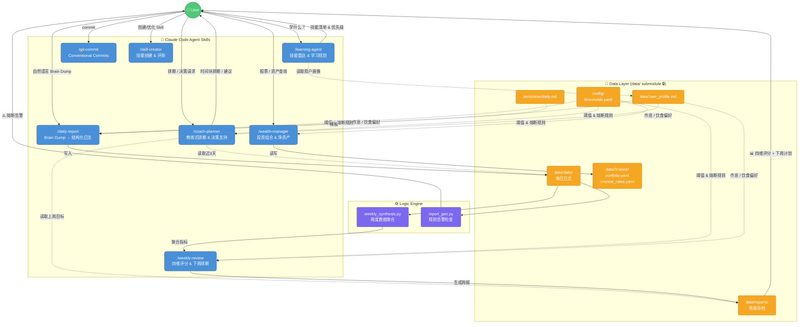
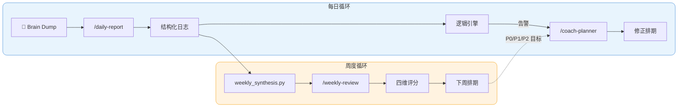

# Personal-OS

个人管理系统 Repo，通过结构化日志、逻辑引擎与 AI Agent 实现数据驱动的自我管理。

## 核心闭环

```
每日 Brain Dump → Daily Agent 结构化 → 逻辑引擎告警 → 周度聚合 → Weekly Agent 分析 → 下周排期
```

## 目录结构

```
personal-os/
├── .agents/skills/            # Claude Code Agent Skills
│   ├── coach-planner/         #   教练式每日排期生成
│   ├── daily-report/          #   Brain Dump → 结构化日志
│   ├── wealth-manager/        #   投资组合与资产分析
│   ├── learning-agent/        #   技能雷达与学习规划
│   ├── skill-creator/         #   技能创建与评测
│   └── git-commit/            #   智能 commit message
├── config/
│   └── thresholds.yaml        # 系统阈值配置 (睡眠基准、支出告警、评分权重等)
├── data/                      # 🔒 Private submodule (personal-os-data)
│   ├── daily/                 #   每日工程师日志 (YYYY-MM-DD.md)
│   ├── finance/
│   │   ├── portfolio.yaml     #   投资组合配置 (资产配置、基金持仓)
│   │   └── interest_rates.yaml #  利率参考数据 (定存、货币基金等)
│   ├── reports/               #   生成的周报存档
│   └── user_profile.md        #   全局用户画像 (作息/饮食/锻炼偏好)
├── templates/
│   └── daily.md               # 标准空白日志模板
├── scripts/
│   ├── report_gen.py          # 逻辑引擎 — 规则告警检查器
│   └── weekly_synthesis.py    # 周度数据聚合管道
├── Makefile                   # 一键自动化入口
└── CLAUDE.md                  # AI 协作规范
```

## 快速开始

```bash
# 首次克隆（含私有 data submodule）
git clone --recurse-submodules https://github.com/KelvinYou/personal-os.git

# 生成今天的日志模板
make today

# 填写完日志后，运行逻辑引擎检查
make check

# 周末：聚合本周数据，生成周报 prompt
make weekly

# 一键完整流程
make report
```

## 逻辑引擎规则

所有阈值集中管理于 `config/thresholds.yaml`，脚本中零硬编码。

| 规则 | 触发条件 | 级别 |
|------|---------|------|
| Deep Work 关联性检查 | `deep_work_hours` < 4h | Warning |
| 精力预警 | `energy_level` < 5 | Warning |
| 连续睡眠恶化 | 连续 3 天 `sleep_quality: Poor` | Critical |
| 睡眠负债堆积 | 累计负债 >= 10h | Critical |
| 咖啡因违规 | `caffeine_cutoff` > 16:00 | Warning |
| 周度支出告警 | 累计支出 > $100 | Warning |

## 评分框架 (Weekly Review)

| 维度 | 满分 | 评估内容 |
|------|------|---------|
| 产出分 (Output) | 40 | Deep Work 总量与工作质量 |
| 健康分 (Health) | 30 | 精力值、睡眠负债、咖啡因归因 |
| 心智分 (Mental) | 20 | 抗干扰能力、危机熔断果断度 |
| 习惯分 (Habits) | 10 | 消费控制、微习惯执行 |

## Multi-Agent 协作架构



### 核心协作循环



## Claude Code Skills

本项目集成了多个 Claude Code Agent Skills，通过斜杠命令调用：

| 命令 | 功能 |
|------|------|
| `/daily-report` | Brain Dump 转结构化日志 |
| `/weekly-review` | 周度综合分析与下周排期 |
| `/wealth-manager` | 投资组合分析、买入时机、净资产汇总 |
| `/coach-planner` | 教练式每日时间块排期 |
| `/learning-agent` | AI 时代技能雷达与学习规划 |
| `/git-commit` | 智能 conventional commit |

## 依赖

```bash
pip install pyyaml
```
