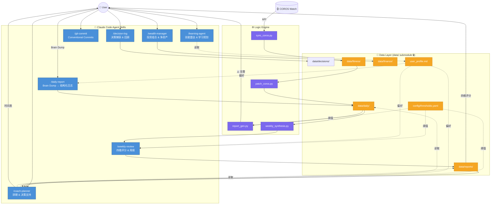

# Personal-OS

个人管理系统 Repo，通过结构化日志、逻辑引擎与 AI Agent 实现数据驱动的自我管理。

> 详细架构图见 [architecture.md](architecture.md) | 产品方向见 [VISION.md](VISION.md)

## 核心闭环

```
Brain Dump → /daily-report → 逻辑引擎告警 → /coach-planner → 每日排期
                ↑                                      ↑
         COROS 手表自动同步                      /weekly-review
         (sleep/HRV/活动)                       (四维评分 + 目标)
```

## 目录结构

```
personal-os/
├── .agents/skills/            # Claude Code Agent Skills
│   ├── coach-planner/         #   教练式每日排期生成
│   ├── daily-report/          #   Brain Dump → 结构化日志
│   ├── wealth-manager/        #   投资组合与资产分析
│   ├── learning-agent/        #   技能雷达与学习规划
│   ├── skill-creator/         #   技能创建与评测
│   └── git-commit/            #   智能 commit message
├── config/
│   └── thresholds.yaml        # 系统阈值配置 (睡眠基准、支出告警、评分权重等)
├── data/                      # 🔒 Private submodule (personal-os-data)
│   ├── daily/                 #   每日工程师日志 (YYYY-MM-DD.md)
│   ├── decisions/             #   决策日志 (YYYY-MM-DD-slug.md)
│   ├── fitness/               #   COROS 原始数据 (YYYY-MM-DD.yaml)
│   ├── finance/
│   │   ├── portfolio.yaml     #   投资组合配置 (资产配置、基金持仓)
│   │   └── interest_rates.yaml #  利率参考数据 (定存、货币基金等)
│   ├── reports/               #   生成的周报存档
│   └── user_profile.md        #   全局用户画像 (作息/饮食/锻炼偏好)
├── templates/
│   └── daily.md               # 标准空白日志模板
├── scripts/
│   ├── sync_coros.py          # COROS API 拉取 → data/fitness/
│   ├── patch_coros.py         # 将 fitness yaml 写入日志 frontmatter
│   ├── report_gen.py          # 逻辑引擎 — 规则告警检查器
│   └── weekly_synthesis.py    # 周度数据聚合管道
├── Makefile                   # 一键自动化入口
└── CLAUDE.md                  # AI 协作规范
```

## 快速开始

```bash
# 首次克隆（含私有 data submodule）
git clone --recurse-submodules https://github.com/KelvinYou/personal-os.git

# 生成今天的日志模板
make today

# 同步 COROS 昨日数据 (睡眠/HRV/活动 → 自动写入日志)
make sync-coros

# 填写完日志后，运行逻辑引擎检查
make check

# 周末：聚合本周数据，生成周报 prompt
make weekly

# 一键完整流程 (check + weekly)
make report

# 列出到期待 review 的决策
make decisions-due

# 创建新决策条目
make decision-new SLUG=cancel-gym
```

## COROS 自动同步

`make sync-coros` 一键完成三步：

1. 从 COROS API (`teamapi.coros.com`) 拉取睡眠/恢复/训练/活动数据
2. 写入 `data/fitness/YYYY-MM-DD.yaml`
3. 自动 patch 对应 `data/daily/YYYY-MM-DD.md` 的 frontmatter

需在项目根目录创建 `.env`：

```env
COROS_EMAIL=your@email.com
COROS_PASSWORD=yourpassword
COROS_REGION=us
```

## 逻辑引擎规则

所有阈值集中管理于 `config/thresholds.yaml`，脚本中零硬编码。

| 规则 | 触发条件 | 级别 |
|------|---------|------|
| 精力预警 | `energy_level` < 5 | Warning |
| 精力崩溃 | `energy_level` < 4 | Critical → Breaker |
| 睡眠不足 | `sleep.duration` < 6.5h | Critical → Breaker |
| 睡眠负债 L1 | 7日滚动负债 ≥ 5h | Breaker |
| 睡眠负债 L2 | 7日滚动负债 > 8h | Breaker |
| HRV 告警 | `readiness.hrv` < 30ms | Breaker |
| 连续低质量睡眠 | 连续 ≥ 2 天 Poor | Breaker → System Offline |
| 心智过载 | `mental_load` ≥ 7 | Breaker |
| 咖啡因违规 | `caffeine_cutoff` > 16:00 | Warning |
| 周度支出告警 | 累计支出 > RM120 | Warning |

## 评分框架 (Weekly Review)

| 维度 | 满分 | 评估内容 |
|------|------|---------|
| 产出分 (Output) | 40 | 工作产出与项目进展 |
| 健康分 (Health) | 30 | 精力值、睡眠负债、运动执行 |
| 心智分 (Mental) | 20 | 抗干扰能力、危机熔断果断度 |
| 习惯分 (Habits) | 10 | 消费控制、微习惯执行 |

## Multi-Agent 协作架构



## Claude Code Skills

| 命令 | 功能 |
|------|------|
| `/daily-report` | Brain Dump 转结构化日志 |
| `/weekly-review` | 周度综合分析与下周目标 |
| `/coach-planner` | 教练式排期 + 实时决策支持 |
| `/wealth-manager` | 投资组合分析、买入时机、净资产汇总 |
| `/learning-agent` | AI 时代技能雷达与学习规划 |
| `/decision-log` | 决策日志捕获与回顾 |
| `/git-commit` | 智能 conventional commit |

## 依赖

```bash
pip install pyyaml python-dotenv
# COROS 同步额外需要 coros_api (内部包)
```
