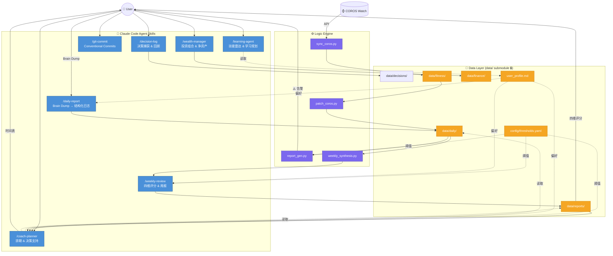

# Personal-OS

个人管理系统 Repo，通过结构化日志、逻辑引擎与 AI Agent 实现数据驱动的自我管理。

> 详细架构见 [ARCHITECTURE.md](ARCHITECTURE.md) | 产品方向见 [docs/VISION.md](docs/VISION.md)

## 核心闭环

```
Brain Dump → /daily-report → 逻辑引擎告警 → /coach-planner → 每日排期
                ↑                                      ↑
         COROS 手表自动同步                      /weekly-review
         (sleep/HRV/活动)                       (四维评分 + 目标)
```

## 目录结构

完整目录树的唯一 owner 是 [AGENTS.md](AGENTS.md)（每条路径由 `make doctor` 逐条
`test -e` 校验）。这里只给一张入口地图 —— 把树抄第二份，两边一定会漂移。

| 位置 | 是什么 |
|------|--------|
| `.agents/skills/` | Agent skills（见下方 [Claude Code Skills](#claude-code-skills)） |
| `config/` | 我的阈值设定 + 法规常量 |
| `market/` | 外部可观测市场事实（利率 / 汇率 / JD 抓取）；public，无个人信息 |
| `data/` | 🔒 private submodule —— 日志、决策、体能、财务、user_profile |
| `scripts/` | Python 自动化（逻辑引擎、COROS 同步、周度聚合、doctor…） |
| `web/` | 本地理财仪表盘（Next.js，localhost only） |
| `repos/` | 外部项目 submodules（portfolio-website / ai-stock-analysis） |
| `docs/` | 三个 owner：VISION（方向）/ ROADMAP（待办）/ DECISIONS（已决定不重提） |
| `templates/` · `tests/` | 空白模板 / 单元测试（不读真实私有数据） |
| `ARCHITECTURE.md` | 系统架构 + 不变量 (codemap) |
| `AGENTS.md` | AI 协作规范 + 目录树（CLAUDE.md 仅 import 它） |

## 快速开始

```bash
# 首次克隆（含私有 data submodule）
git clone --recurse-submodules https://github.com/KelvinYou/personal-os.git
# ⚠️ data 是 private repo：无权限时这一步会对它报 repository not found。
#    这是访问控制的预期行为，可忽略——仓库其余部分照常可用，只有 make wealth /
#    make web 不可用。有权限但 data/ 仍是空目录时跑 make setup-private。

# 建立 .venv 并安装依赖（见 requirements.txt）
make setup

# 环境自检：区分「坏了」与「按设计就不该有」
make doctor

# 生成今天的日志模板
make today

# 同步 COROS 昨日数据 (睡眠/HRV/活动 → 自动写入日志)
make sync-coros

# 同步 Google Calendar 日程
make sync-calendar

# 填写完日志后，运行逻辑引擎检查
make check

# 周末：聚合本周数据，生成周报 prompt
make weekly

# 一键完整流程 (check + weekly)
make report

# 净资产：现金/到期/利率 + 股票估值
make wealth

# 本地理财仪表盘 (localhost only，不部署)
make web

# 单元测试 + web typecheck / 日志 lint
make test
make lint

# 把 90 天热窗口之外的日志折叠进 data/archive/
make archive

# 列出到期待 review 的决策
make decisions-due

# 创建新决策条目
make decision-new SLUG=cancel-gym

# 决策校准分析 (需要 reviewed 决策)
make calibration

# 季度身份审计 (需 ≥ 12 周日志)
make quarterly
```

## COROS 自动同步

`make sync-coros` 一键完成三步：

1. 从 COROS API (`teamapi.coros.com`) 拉取睡眠/恢复/训练/活动数据
2. 写入 `data/fitness/YYYY-MM-DD.yaml`
3. 自动 patch 对应 `data/daily/YYYY-MM-DD.md` 的 frontmatter

需在项目根目录创建 `.env`：

```env
COROS_EMAIL=your@email.com
COROS_PASSWORD=yourpassword
COROS_REGION=us
```

## 逻辑引擎规则

所有阈值集中管理于 `config/thresholds.yaml`，脚本中零硬编码。

| 规则 | 触发条件 | 级别 |
|------|---------|------|
| 精力预警 | `energy_level` < 5 | Warning |
| 精力崩溃 | `energy_level` < 4 | Critical → Breaker |
| 睡眠不足 | `sleep.duration` < 6.5h | Critical → Breaker |
| 睡眠负债 L1 | 7日滚动负债 ≥ 5h | Breaker |
| 睡眠负债 L2 | 7日滚动负债 > 8h | Breaker |
| HRV 告警 | `readiness.hrv` < 30ms | Breaker |
| 连续低质量睡眠 | 连续 ≥ 2 天 Poor | Breaker → System Offline |
| 心智过载 | `mental_load` ≥ 7 | Breaker |
| 咖啡因违规 | `caffeine_cutoff` > 16:00 | Warning |
| 周度支出告警 | 累计支出 > RM120 | Warning |

## 评分框架 (Weekly Review)

| 维度 | 满分 | 评估内容 |
|------|------|---------|
| 产出分 (Output) | 40 | 工作产出与项目进展 |
| 健康分 (Health) | 30 | 精力值、睡眠负债、运动执行 |
| 心智分 (Mental) | 20 | 抗干扰能力、危机熔断果断度 |
| 习惯分 (Habits) | 10 | 消费控制、微习惯执行 |

## Multi-Agent 协作架构


```mermaid
graph TB
    User((👤 User))
    COROS_HW[("⌚ COROS Watch")]

    subgraph Skills ["🤖 Claude Code Agent Skills"]
        DR["/daily-report\nBrain Dump → 结构化日志"]
        CP["/coach-planner\n排期 & 决策支持"]
        WR["/weekly-review\n四维评分 & 周报"]
        WM["/wealth-manager\n投资组合 & 净资产"]
        LA["/learning-agent\n技能雷达 & 学习规划"]
        DJL["/decision-log\n决策捕获 & 回顾"]
        GC["/git-commit\nConventional Commits"]
    end

    subgraph Data ["📂 Data Layer (data/ submodule 🔒)"]
        DL["data/daily/"]
        DEC["data/decisions/"]
        FIT["data/fitness/"]
        RPT["data/reports/"]
        FIN["data/finance/"]
        CFG["config/thresholds.yaml"]
        UP["user_profile.md"]
    end

    subgraph Engine ["⚙️ Logic Engine"]
        SC["sync_coros.py"]
        PC["patch_coros.py"]
        RG["report_gen.py"]
        WS["weekly_synthesis.py"]
    end

    User -- "Brain Dump" --> DR --> DL
    COROS_HW -- "API" --> SC --> FIT --> PC --> DL
    DL --> RG -- "⚠️ 告警" --> User
    User --> CP -. "读取" .-> DL & RPT
    CP -- "时间表" --> User
    DL --> WS --> WR --> RPT -- "四维评分" --> User
    RPT --> CP
    User --> WM --> FIN
    User --> LA -. "读取" .-> UP
    CFG -. "阈值" .-> RG & WR & CP
    UP -. "偏好" .-> DR & CP & WR
    User --> DJL --> DEC
    User --> GC

    classDef agent fill:#4A90D9,stroke:#2C5F8A,color:#fff
    classDef data fill:#F5A623,stroke:#C77D0A,color:#fff
    classDef script fill:#7B68EE,stroke:#5A4CB5,color:#fff
    class DR,CP,WR,WM,LA,DJL,GC agent
    class DL,FIT,RPT,FIN,CFG,UP data
    class SC,PC,RG,WS script
```

## Claude Code Skills

| 命令 | 功能 |
|------|------|
| `/daily-report` | Brain Dump 转结构化日志 |
| `/weekly-review` | 周度综合分析与下周目标 |
| `/coach-planner` | 教练式排期 + 实时决策支持 |
| `/wealth-manager` | 投资组合分析、买入时机、净资产汇总 |
| `/learning-agent` | AI 时代技能雷达与学习规划 |
| `/decision-log` | 决策日志捕获 |
| `/decision-review` | 决策回顾与校准 |
| `/meta-coach` | 月度 agent 建议质量审计 |
| `/identity-audit` | 季度行为 vs 声称身份审计 |
| `/profile-optimizer` | 用 JD 数据改写 LinkedIn / portfolio 文案与排序 |
| `/contract-guardian` | 跨层改动（schema / 脚本 / 文档）的语义契约审查 |
| `/quant-backtest-review` | ai-stock-analysis 回测与信号代码的对抗式复核 |
| `/repo-orchestrator` | 多仓库协作：submodule 同步、集成检查、提交前把关 |
| `/skill-creator` | 技能创建、优化与 eval |
| `/git-commit` | 智能 conventional commit |

## 依赖

依赖清单的唯一 owner 是 `requirements.txt`（PyYAML / python-dotenv / pydantic /
pydantic-settings / Google Calendar 客户端）。不要手抄成一行 `pip install` ——
那份清单已经漏过 pydantic 一次。

```bash
make setup     # python3 -m venv .venv && pip install -r requirements.txt
make doctor    # 验证 venv、私有数据、股价 pipeline、web 依赖
# COROS 同步额外需要 coros_api (内部包)
# 仪表盘另需 Node: cd web && npm i
```
