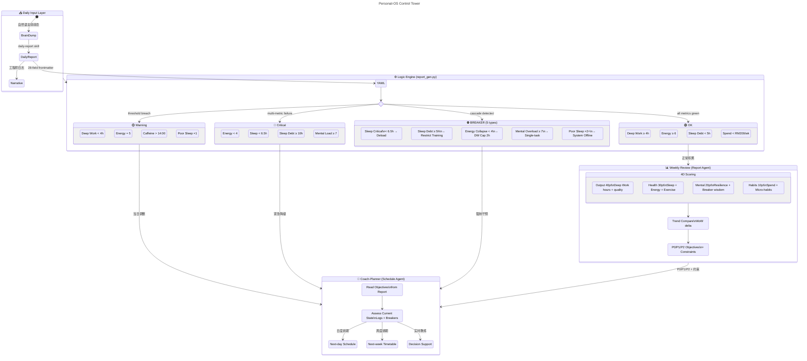

# Personal-OS — 产品方向与架构愿景

## 核心定位

**一套以工程师思维构建的个人控制系统**——不是简单的习惯追踪器，而是具备状态感知、梯度降级、闭环反馈的自我管理操作系统。

## 设计哲学

1. **Config-Driven** — 所有阈值外部化，零硬编码魔法数字
2. **Graceful Degradation** — 4 级运行模式（OK → Warning → Critical → Breaker），不是 on/off
3. **Closed-Loop Feedback** — 每日记录 → 逻辑引擎告警 → 周度综合分析 → 下周排期
4. **AI-Native** — 系统从第一天就为 Agent 协作设计，不是事后加 AI
5. **Honesty Over Vanity** — 记录真实数据，接受低分，做根因分析

## 系统控制流

## 四级运行模式

| 模式 | 触发条件 | 系统响应 |
|------|----------|----------|
| **🟢 OK** | 所有指标绿灯 | 正常积累，数据汇入周度分析 |
| **🟡 Warning** | 单指标越线 | coach-planner 当日微调排期 |
| **🔴 Critical** | 多指标同时恶化 | 紧急降级：削减 Deep Work、强制休息 |
| **⛔ Breaker** | 级联故障检测 | 强制干预：Deload / Single-task / System Offline |

## Agent 职责分离

| Agent | 方向 | 输入 | 输出 |
|-------|------|------|------|
| **weekly-review** | 向后看 | 7天日志 + 上周报告 | 诊断报告 + 4D评分 + P0/P1/P2目标 + 执行约束 |
| **coach-planner** | 向前看 | 日志 + 报告目标 + 熔断状态 | 当日/当周/下周时间表 + 决策支持 |

**数据流**：weekly-review 只产出诊断，coach-planner 只产出行动。两者通过 P0/P1/P2 目标接口解耦。

## 双时间轴决策

- **日度（实时）**：brain dump → logic engine → coach-planner → 当天时间表
- **周度（回顾+规划）**：7天聚合 → weekly-review(评分+目标) → coach-planner(下周排期)

## 未来演进方向

### Near-term
- [ ] Logic engine 单元测试覆盖（pytest）
- [ ] COROS / Zepp 数据自动导入（CSV / API）
- [ ] 历史数据查询层（SQLite 替换 flat YAML）

### Mid-term
- [ ] 睡眠债务预测模型（时序分析）
- [ ] 训练负荷周期化（mesocycle 自动排期）
- [ ] 支出燃烧率预警（月度 burn-rate projection）

### Long-term
- [ ] Mobile companion（时间表推送 + 快速 brain dump）
- [ ] 穿戴设备实时流（心率 / HRV → 自动触发 breaker）
- [ ] 多用户抽象（从 personal tool → 可复用框架）
