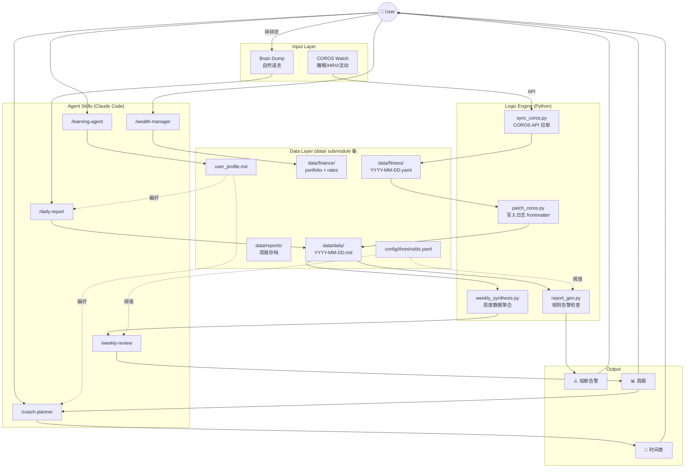
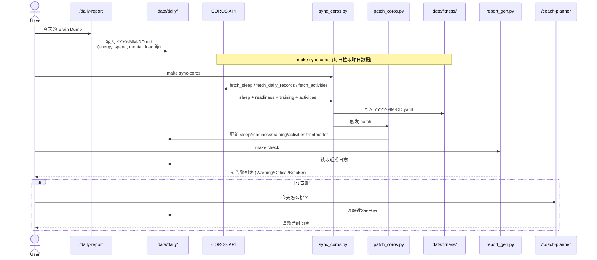
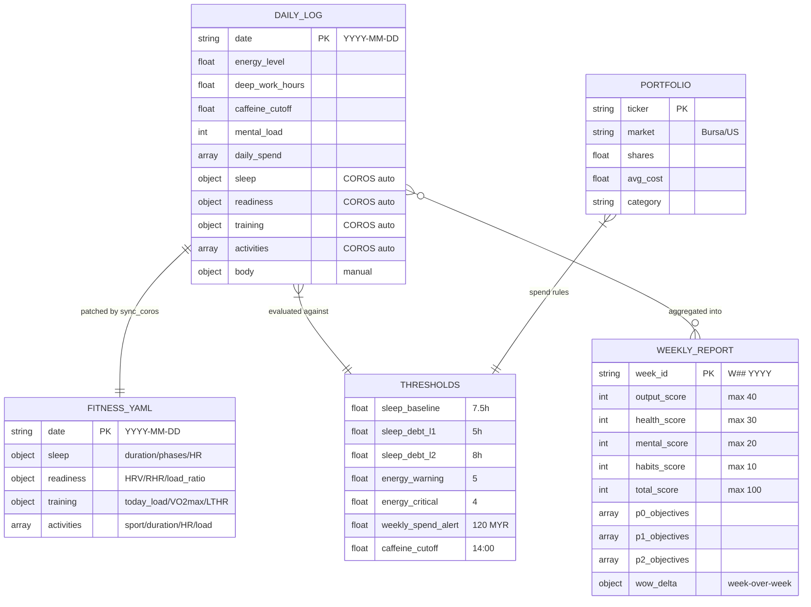
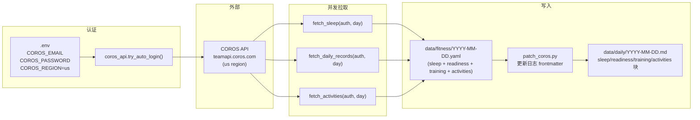
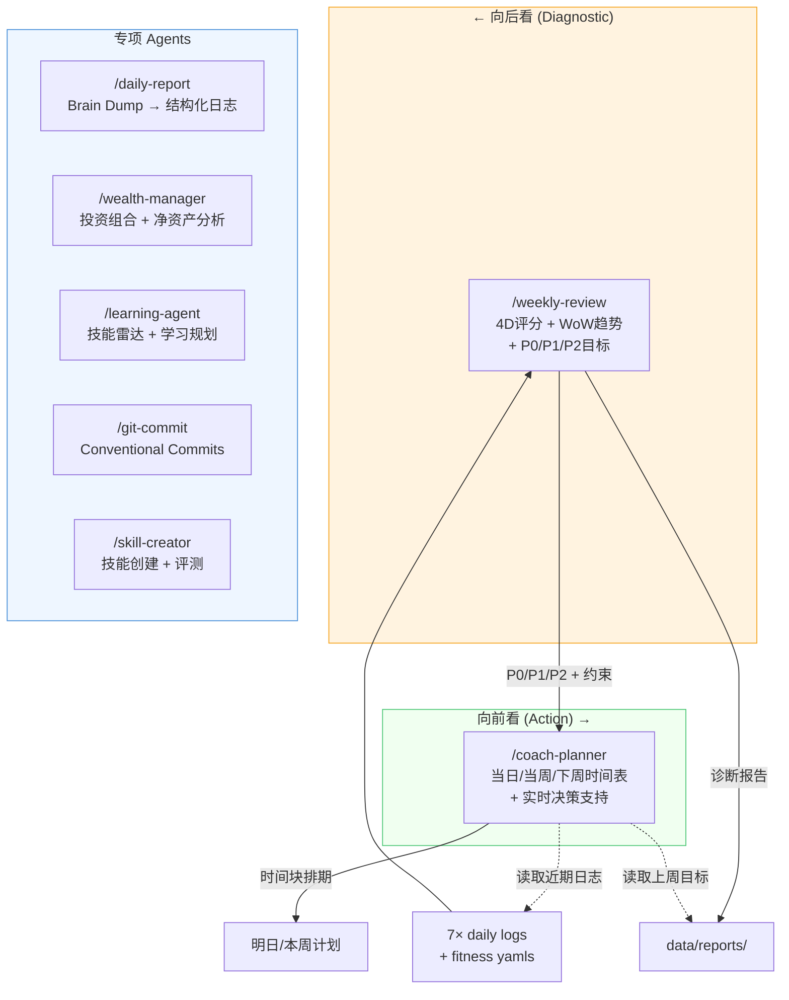

# Personal-OS — Architecture

## 1. System Overview



---

## 2. Daily Loop

每天的核心数据闭环：Brain Dump 结构化 + COROS 自动填充 + 逻辑引擎告警。



---

## 3. Weekly Loop

每周日的回顾与下周排期双循环。

```mermaid
graph LR
    subgraph Collect ["① 数据聚合"]
        D["7× YYYY-MM-DD.md\n+ data/fitness/"] --> WS["weekly_synthesis.py"]
        WS --> PROMPT["weekly_report_prompt.md\n聚合摘要"]
    end

    subgraph Review ["② 周度回顾 (向后看)"]
        PROMPT --> WR["/weekly-review"]
        WR --> SCORE["四维评分\nOutput·Health·Mental·Habits"]
        SCORE --> DIAG["诊断报告\n+ WoW 趋势对比"]
        DIAG --> OBJ["P0/P1/P2 目标\n+ 执行约束"]
        OBJ --> RPT["data/reports/W##.md"]
    end

    subgraph Plan ["③ 下周排期 (向前看)"]
        RPT --> CP["/coach-planner"]
        CP --> TT["下周时间表\n(周一~周日时间块)"]
    end

    TT --> User((👤 User))

    style Collect fill:#EEF6FF,stroke:#4A90D9
    style Review fill:#FFF3E0,stroke:#F5A623
    style Plan fill:#F0FFF0,stroke:#50C878
```



---

## 4. Data Layer



---

## 5. COROS Sync Pipeline



---

## 6. Circuit Breaker State Machine

```mermaid
stateDiagram-v2
    direction LR

    [*] --> OK

    OK --> Warning: 单指标越线
    Warning --> OK: 指标恢复

    Warning --> Critical: 多指标恶化
    Critical --> Warning: 部分恢复

    Critical --> Breaker: 级联触发
    Breaker --> Critical: 主指标改善

    state OK {
        note: energy≥6, sleep_debt<5h\nspend正常, 无连续 Poor
    }

    state Warning {
        note: deep_work<4h\nenergy=5\ncaffeine>14:00\nPoor Sleep ×1
    }

    state Critical {
        note: energy<4\nsleep<6.5h\nsleep_debt≥10h\nmental_load≥7
    }

    state Breaker {
        SleepCritical: Sleep Critical\nsleep<6.5h → Deload 全禁训
        DebtL1: Sleep Debt L1\n≥5h → Zone2 限速
        DebtL2: Sleep Debt L2\n>8h → 步行 only
        EnergyCollapse: Energy Collapse\n<4 → DW cap 2h
        MentalOverload: Mental Overload\n≥7 → 单任务模式
        PoorStreak: Poor Sleep ×2\n→ System Offline
        HRVAlert: HRV<30\n→ 禁高强度
    }
```

---

## 7. Agent Skill Responsibilities


