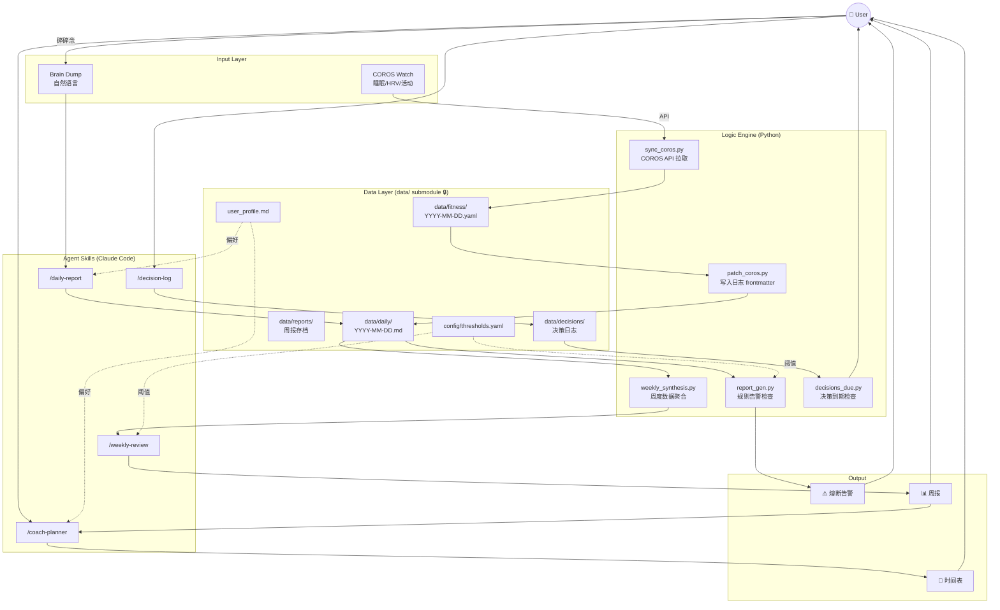
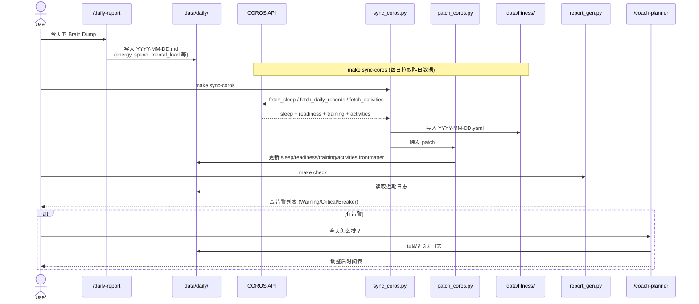
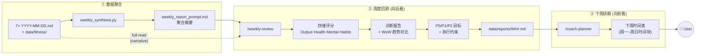
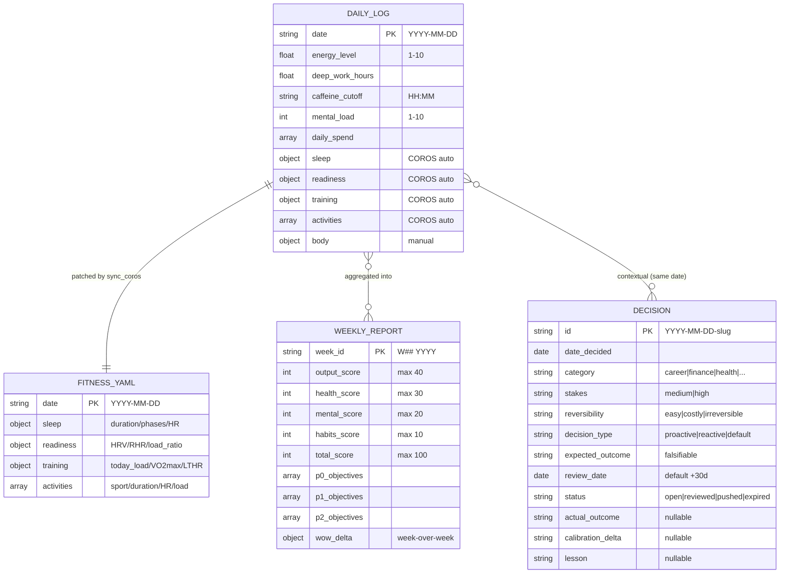
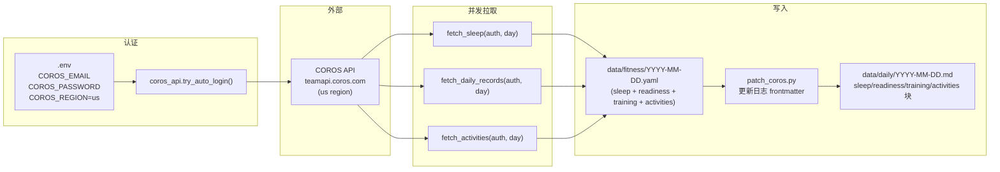
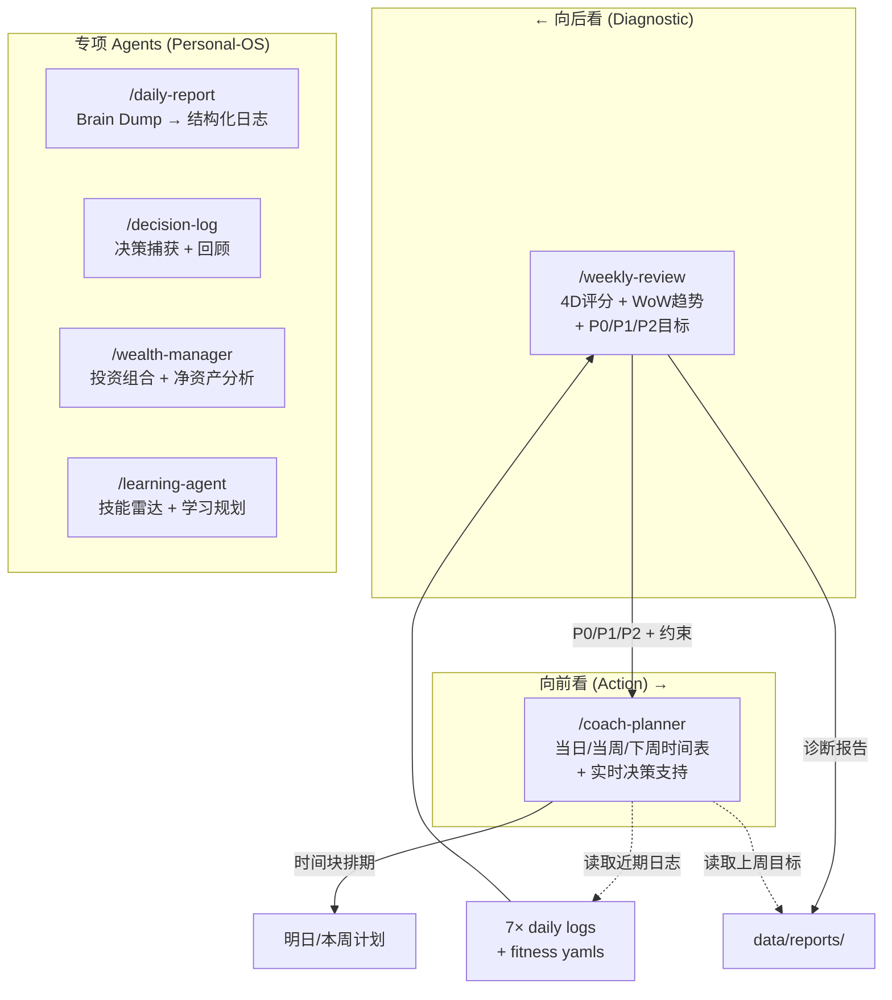
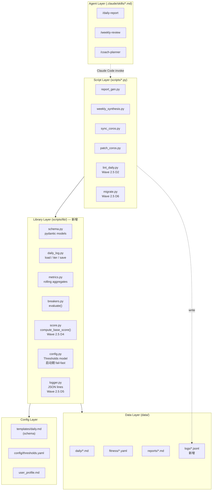

# Personal-OS — Architecture

Personal-OS 是单用户本地的数据驱动自我管理系统。核心闭环：每日 Brain Dump + COROS 自动同步构成结构化日志 → 逻辑引擎扫描触发熔断告警 → 周日聚合分析产出四维评分和诊断 → coach-planner 基于诊断排下周时间表。

**设计原则**：
- **人类可读优先** —— Markdown + YAML 作为存储介质，拒绝 SQLite/DB，保 `cat` + `grep` + 手改的工作流
- **职责分层** —— AI 负责 flexible narrative（评分解读、blocker 根因、排期叙事），代码负责 deterministic metrics（阈值判定、聚合、熔断）
- **本地单用户** —— 不做 cron / 云同步 / 多租户；所有自动化通过 `make` 显式触发
- **失败友好** —— 缺数据跳过而非崩溃；任何一天的日志残缺不影响其他天聚合

---

## 1. System Overview

> 说明：本架构图聚焦 Personal-OS 核心数据闭环。独立的专项 agent（wealth-manager 读写 `data/finance/`、learning-agent 更新 `user_profile.md`）见 §7。

---

## 2. Daily Loop

每天的核心数据闭环：Brain Dump 结构化 + COROS 自动填充 + 逻辑引擎告警。

---

## 3. Weekly Loop

每周日的回顾与下周排期双循环。

> `/weekly-review` 除了读 `weekly_report_prompt.md` 的聚合摘要外，**还会直接通读 7 天 daily log**（SKILL.md Step 1.3），以捕捉 highlights / blockers / 营养等 narrative 上下文。

---

## 4. Data Layer

仅列出核心闭环中的 persisted entities。配置（`config/thresholds.yaml`、`user_profile.md`）和专项 agent 数据（`data/finance/`）不在此图。

---

## 5. COROS Sync Pipeline

### 设计 tradeoff：fitness.yaml ↔ daily.md 双写

`data/fitness/*.yaml` 与 `data/daily/*.md` 的 `sleep / readiness / training / activities` 四块**故意双写**（`patch_coros.py` 的存在即为此）。这是经过评估后的选择：

| 方案 | 优点 | 缺点 | 决策 |
|------|------|------|------|
| **当前：yaml → patch → md（双写）** | daily.md 自包含，`cat 2026-04-22.md` 可见全部当日数据；grep 查询无需 join | COROS 数据两处存储，有 stale-copy 风险（用户手改 md 的 sleep 块会在下次 sync 被覆盖） | ✅ 采用 |
| 替代：yaml 独占，md 只存 ref 指针，聚合时 join | 无双写；用户手改 md 不丢失 | daily.md 不再自包含；所有聚合 / 查询需 on-read merge；损失 grep 工作流 | ❌ 拒绝（见 plan `Out of Scope #10`） |

**用户契约**（与 §8.2 对齐）：`sleep.* / readiness.* / training.* / activities[]` 在 daily.md 中对**所有非 `patch_coros.py` 的 writer 只读**；若需手动修正，改 `data/fitness/*.yaml` 后重跑 `make sync-coros DATE=YYYY-MM-DD`，否则下次 sync 会覆盖。

---

## 6. Circuit Breakers

`report_gen.py` 独立遍历 `config/thresholds.yaml` 的 `circuit_breakers` 列表，按 metric + operator 匹配最近日志逐条判定 —— **没有显式 state machine**，每个 breaker 是独立规则，可同时触发多条。

| Breaker | Metric | Condition | 主要约束 (节选) |
|---------|--------|-----------|----------------|
| Sleep Critical | `sleep_duration` | `< 6.5h` | 禁晨跑；禁大重量；DW cap 4h；22:00 强制断电 |
| Sleep Debt L1 | `rolling_7d_sleep_debt` | `>= 5.0` | 跑步降级 Z2 (≤ 145bpm, 30min)；训练降重 30% |
| Sleep Debt L2 | `rolling_7d_sleep_debt` | `> 8.0` | 禁跑步，仅低心率快走；训练降重 50%；周末零产出 |
| Energy Collapse | `energy_level` | `< 4` | 取消当日全部训练；DW cap 2h；21:30 断电 |
| Mental Overload | `mental_load` | `>= 7` | 单任务模式；禁额外会议/社交；2h 强制 15min 呼吸间隔 |
| Consecutive Poor Sleep | `consecutive_poor_sleep` | `>= 2` | 次日 System Offline；咖啡因窗口 10:00 前；DW cap 3h |
| HRV Recovery Alert | `hrv` | `< 30ms` | 禁高强度；强制午休 20-30min；22:00 强制断电 |
| Spending Surge | `single_transaction` | `> RM 30` | 日志记录消费理由；剩余天数自炊率 ≥ 95% |

完整 `actions` 列表见 `config/thresholds.yaml` 的 `circuit_breakers` 块。

**Null-safe 判定**：commit `f4b943e` 之后，`report_gen.py` 在 `actual is None` 时**跳过该 breaker**（而非 default 0），避免缺数据日（尤其 HRV 未同步时）产生 false positive。`weekly_synthesis.py` 待 A3 迁移后对齐同样行为。

**Poor Sleep derivation**（Option P-d，替代已删的 `sleep.quality`）：`duration < 6.5h` **或** `(awake_min > 40 AND hrv < hrv_baseline × 0.9)`。

---

## 7. Agent Skill Responsibilities

> Claude Code 的通用 skill（`/git-commit`、`/skill-creator`、`/review` 等）不属于 Personal-OS 系统组件，故不列入本图。

---

## 8. Invariants & Contracts

系统的一致性靠以下**隐性契约**维持。显式列出来便于 review、debug、未来演进。

### 8.1 Schema 所有权

- `templates/daily.md` 是 daily frontmatter 的 schema source of truth
- 任何未在模板中声明的顶级 key 视为未知（Wave 2.5 D2 `make lint` 会拒绝）
- `config/thresholds.yaml` 是所有阈值 + breaker 规则的唯一来源；脚本内禁止硬编码数字
- `user_profile.md` 是作息 / 饮食 / 训练偏好的唯一来源；skill 评分或排期涉及偏好时必须读这里

### 8.2 字段写入所有权

| Field | 写入方 | 冲突规则 |
|-------|--------|----------|
| `sleep.*` / `readiness.*` / `training.*` / `activities[]` | `patch_coros.py` 独占 | 用户手改会在下次 `make sync-coros` 被覆盖（见 §5 tradeoff） |
| `energy_level` / `mental_load` / `deep_work_hours` / `caffeine_cutoff` / `primary_blocker` / `daily_spend` | `/daily-report` skill 或用户手编 | 后写覆盖；skill 遵守"合并不覆盖"（`daily-report/SKILL.md:58`） |
| 正文 Highlights / Blockers / Next Steps / Nutrition | `/daily-report` skill 或用户手编 | 同上 |
| `body.*` | 用户手编**独占** | 任何脚本 / skill 不写（per `feedback-body-data-manual`） |

### 8.3 读契约

| 组件 | 读取内容 |
|------|---------|
| `report_gen.py` | 所有 `daily/*.md` frontmatter；**忽略正文** |
| `weekly_synthesis.py` | 本周 frontmatter + 正文前 500 字符（Token 预算） |
| `/weekly-review` | 本周 frontmatter + **完整正文** + `weekly_report_prompt.md` + 上周 report |
| `/coach-planner` | 最近 3 天 frontmatter + 完整正文 + `user_profile.md` + 上周 report |
| `/daily-report` | `templates/daily.md` + `user_profile.md` + （若存在）当日现有 daily.md（合并模式） |
| `decisions_due.py` | `data/decisions/*.md` frontmatter only（status + review_date） |
| `/decision-log` | `templates/decision.md`（schema）+ brain dump input |

### 8.4 Breaker 评估不变式

- **无状态**：每次 run 独立从日志重新 derive 所有 `latest_metrics`；不保留跨 run 状态
- **无级联 / 无优先级**：多个 breaker 独立并行评估，同一 run 可同时 trip 多条
- **Null-safe**（post-Wave 1）：`actual is None` → 跳过该 breaker；避免缺数据 default 0 产生 false positive
- **Poor Sleep derivation**（Option P-d）：`duration < 6.5h OR (awake_min > 40 AND hrv < hrv_baseline × 0.9)`；Wave 2.5 D1 之后在 `scripts/lib/daily_log.py::derive_poor_sleep` 单一实现

### 8.5 时间 / 周界契约

- daily.md 日期 = 吉隆坡本地日期（`TZ=Asia/Kuala_Lumpur`）
- 周界 = ISO week（周一起，周日止）
- `make sync-coros` 默认拉取 `today − 1`（昨日数据早晨才完整同步到 COROS 云端）
- `rolling_7d_sleep_debt` = `today` 往回 7 天的 `Σ max(0, baseline − duration)`
- `consecutive_poor_sleep` = 从最近一天往回数，遇到第一个非 Poor 日即停

### 8.6 失效模式

| 失效 | 系统行为 |
|------|---------|
| COROS 认证失败 | `sync_coros.py` 非零退出，不写部分数据；daily.md 保持上一次状态 |
| `data/daily/YYYY-MM-DD.md` 缺失 | 聚合脚本 skip 该日，不崩；`days_logged` 自动少 1 |
| frontmatter YAML 解析失败 | 聚合脚本打印 warning，skip 该文件，不崩 |
| 全 null HRV（COROS 未同步或用户未戴表） | HRV Recovery Alert 自动禁用（post-Wave 1 null-skip） |
| `weekly_synthesis` 找到 0 日志 | 打印 warning，不产出 prompt 文件 |
| 指标越界（如 `energy_level: 15`） | `safe_float` 强转 float，无范围校验；Wave 2.5 D2 `make lint` 会拒绝 |
| schema 演进（如删除 `sleep.quality`） | 老日志字段保留为 frontmatter 冗余；通过 Wave 2.5 `scripts/lib/migrate.py` 一次性批量迁移 |
| `data/decisions/*.md` YAML 解析失败 | `decisions_due.py` 打印 warning，skip 该文件，不崩 |

### 8.7 Decision Journal 不变量

- **Schema source**: `templates/decision.md` 是 decision frontmatter 的唯一 schema 定义
- **写入所有权**：`/decision-log` skill 写所有捕获字段（id ~ status）；`/decision-review` skill 独占写 review 字段（actual_outcome / calibration_delta / lesson）
- **读契约**：`weekly-review` 不读 decisions（保持职责分离）；`decisions_due.py` 只读 frontmatter 元数据；未来 meta-coach（L2）读 decisions
- **时间契约**：`review_date` 使用 KL 本地日期，与 daily.md 一致；默认 `date_decided + 30d`
- **expected_outcome immutable**：一旦写入，review 流程不得修改 expected_outcome 字段（防事后合理化）
- **Push 机制**：review 时 outcome 不明确 → `calibration_delta: too_early` + `status: pushed` + `review_date += 30d`

---

## 9. Library Layer (proposed — Wave 2.5)

当前 `scripts/report_gen.py` 与 `scripts/weekly_synthesis.py` **各自独立实现** frontmatter 解析、`safe_float`、Poor Sleep derivation、breaker 评估 —— 这是 Wave 1 schema drift 的结构性根因（plan.md §3.5）。Wave 2.5 引入共享 Library Layer，形成严格的单向依赖与 pydantic 类型化的 schema 边界。

### 分层规则

1. **依赖单向向下**：`Agent → Script → Library → Data/Config`；严禁反向
2. **不跨层直接访问**：Script 层不得直接 `yaml.safe_load` daily frontmatter，必须走 `lib.daily_log.load()`
3. **Library API 以 pydantic 模型为单位**，对外不暴露裸 dict；调用者 type-check 免费
4. **Schema 改动流程**：改 `templates/daily.md` → 改 `lib/schema.py` pydantic model → 写 `lib/migrate.py` 的回填逻辑 → `make migrate` 一次性回填 → `make lint` 验证零漂移

### Library 模块清单

| 模块 | 职责 | 对应 plan 项 |
|------|------|-------------|
| `schema.py` | pydantic 模型：`DailyLog`, `Sleep`, `Readiness`, `Training`, `Activity`, `DailySpend`, `Body`, `Thresholds`, `Breaker` | Wave 2.5 D1 |
| `daily_log.py` | `load(path) → DailyLog`, `iter_week(monday) → Iterator`, `save(log)`, `derive_poor_sleep(log) → bool` | D1 |
| `metrics.py` | `rolling_7d_debt(logs, baseline)`, `avg_hrv(logs)`, `consecutive_poor(logs)` 等聚合 | D1 |
| `breakers.py` | `evaluate(metrics, cfg) → list[TrippedBreaker]`；单一 breaker 判定入口 | D1 |
| `score.py` | `compute_base_score(metrics, rubric) → ScoreBreakdown`；deterministic 四维打分 | D4（promoted to P1） |
| `config.py` | 严格校验 `thresholds.yaml` / `user_profile.md` 结构；启动期 fail-fast | D1 |
| `logger.py` | 每次 `make check` / `make weekly` append JSON line 到 `data/logs/engine-YYYY-MM-DD.jsonl` | D5 |
| `migrate.py` | 字段批量迁移（schema 变更时回填老日志，如 `sleep.quality → derived Option P-d`） | D6 |

### 与 Agent Layer 的分工（post-D4）

Scoring 经过 Wave 2.5 D4 后，职责切分明确：

| 工作 | 归属 | 理由 |
|------|------|------|
| 四维 base score 计算（Output/Health/Mental/Habits） | `lib.score.compute_base_score` | 确定性、可 git-diff、可 replay、可写 unit test |
| Bonus / Penalty 判断（需 qualitative context） | `/weekly-review` skill | 需要 narrative 推理"本周创新解法 +2"这种 |
| WoW 叙事对比、root cause 分析、P0/P1/P2 目标生成 | `/weekly-review` skill | AI 擅长的 narrative 工作 |
| 排期生成 | `/coach-planner` skill | 同上 |
| 熔断告警、阈值判定、聚合 | `lib` + scripts | 100% 确定性 |
