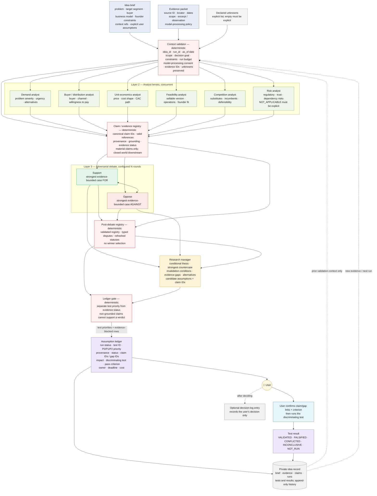

# Startup-Idea Evaluation Pipeline — Design

**Author:** Kelvin<br>
**Status:** Implemented core + demo; benchmark and production rollout pending<br>
**Last updated:** 2026-09-11<br>
**Reviewers:** Kelvin (implementation review)

> **TL;DR:** A multi-agent pipeline evaluates a startup idea against a fixed
> decision context and a user-supplied evidence packet. Its output is an
> assumption ledger, not a success score or a build/no-build recommendation.
> The deterministic part is the context validator, claim/evidence registry,
> and ledger gate. LLM layers may analyse and adjudicate, but every material
> claim must be traceable to an input, an explicit user assumption, a recorded
> derivation, or be visibly marked `MODEL-GUESSED`. Ungrounded load-bearing
> rows remain visible as evidence gaps and may receive only a provisional test
> priority, never a fabricated factual conclusion.

## 1. Context

`repos/ai-stock-analysis` is a working research pipeline: deterministic
ingestion, concurrent analyst agents, an adversarial debate, a research
manager, and a synthesis layer with deterministic guards. The question is
whether that shape helps evaluate a *startup idea* instead of a ticker.

It partly does. The adversarial middle transfers; deterministic market
ingestion, calibrated success scoring, and a stock-style outcome loop do not.
This document defines the smaller set of guarantees an idea evaluator can
honestly provide.

**Driver:** idea evaluation currently happens ad hoc per idea.
`docs/design/pdpa-compliance-agent.md` demonstrates that a structured output
can be useful, but its value comes from explicit assumptions, rejected
alternatives, evidence gaps, and time-boxed tests—not from a single score.

The system is decision support for one user. It does not make a legal
determination, promise startup success, or decide whether the user should
build.

## 2. Scope

What this document decides:

| # | Decision | Proposed answer | Confidence |
|---|---|---|---|
| 1 | Input boundary | A required evaluation context, a hand-supplied evidence packet, and an explicit unknowns list | High |
| 2 | Reuse the ai-stock-analysis pipeline shape | Partially — context validation, analyst lenses, debate, and adjudication; no stock-style ingestion or score | High — verified against source |
| 3 | Primary output | A capped assumption ledger with decision priority and discriminating tests | High |
| 4 | Deterministic guard | A claim/evidence registry plus a post-adjudication ledger gate; no feasibility calculator over guessed inputs | High |
| 5 | Provenance scope | All material claims, quantitative or qualitative—not numbers only | High |
| 6 | Outcome memory | Keep immutable validation history for the same idea; do not use it as a calibrated success score or hidden rescaling factor | High |
| 7 | Storage boundary | Private Markdown/YAML state under `data/ideas/<idea-id>/`; no idea evidence in public `docs/` or `market/` paths | High — implemented behind the private data-submodule guard |
| 8 | Whether to build now | Core kernel and private local lifecycle implemented; pass the pre-build evaluation gates before production model rollout | High |

**Out of scope:** automatic web search, an overall probability of success, an
automated build/no-build recommendation, legal advice, implementation prompt
text, model selection, and a hosted multi-user service.

## 3. Prior art — the worked example already exists

`docs/design/pdpa-compliance-agent.md` is the benchmark for output quality, not
a complete machine contract. It contains:

- a decision table with per-row confidence rather than one score;
- rejected alternatives with distinct reasons;
- open questions ordered by consequence and uncertainty;
- a time-boxed validation plan with concrete next actions;
- explicit human judgment boundaries for legal decisions.

The pipeline must make those useful properties first-class. In particular,
`alternatives`, `evidence_gaps`, and `validation_tests` cannot be left as
incidental prose if the output is meant to be compared across runs.

## 4. What transfers from ai-stock-analysis, and what does not

Verified against the source on 2026-09-11.

### 4.1 Transfers cleanly

The useful shape transfers:

- concurrent analysts provide separate lenses before advocacy begins;
- support and oppose researchers expose one-sided reasoning;
- a research manager separates adjudication from summarisation and must state
  counterexamples, invalidation conditions, and evidence gaps;
- deterministic code may guard the meaning of model output even when it cannot
  determine whether a market will exist.

The startup-specific output is narrower: the research manager proposes
candidate assumptions and their impact; the ledger gate separates test priority
from evidence status and decides which statements satisfy the input-grounding
contract. Input-grounded does not mean fact-checked or true.

### 4.2 Does not transfer

**There is no deterministic Layer 1 fetcher for “is this market real”.** The
stock pipeline can replay `yfinance → TickerData` and validate the bars. For an
idea, market size, competitor pricing, customer urgency, and funding activity
arrive as user-supplied observations. Search results may be useful evidence,
but an LLM search pass is not a reproducible source of truth.

**A feasibility calculator over guessed quantities is rejected.** Arithmetic is
allowed only when the operands and derivation are recorded. The pipeline must
not turn a model-invented CAC, market size, runway, or margin into a precise
looking output.

**A calibrated success score is not available.** Startup outcomes are delayed,
rare, censored by rejected ideas, and confounded by execution. That prevents a
stock-style backtest or reliable probability calibration. It does not prevent
testing the pipeline's process quality: traceability, unknown preservation,
test falsifiability, coverage, cost, and usefulness to the user.

**`decision-log` is not an assumption database.** It records the user's
decisions and later reviews their expected outcomes. Idea evidence and test
results therefore live in the idea record; a final build/stop decision may be
logged separately after the user makes it.

## 5. Proposed pipeline



The central design intent is that the pipeline can produce useful test
priorities even when it cannot justify a factual conclusion. The gate is not a
terminal “decline” branch: it prevents untraceable or explicitly non-grounded
rows from masquerading as evidence or a build recommendation while preserving
the gap and its next test.

## 6. Layer contracts

| Layer | Deterministic? | Input | Output | Owner / rule |
|---|---|---|---|---|
| Context validator | Yes | Brief, evidence packet, declared unknowns, prior idea state | Validated `EvaluationContext` | Preflight assigns `run_id` and records `evaluated_at`; require `idea_id`, `as_of`, decision goal, scope, constraints, run budget, and model-processing consent; require replay flag/reason for historical `as_of`; never infer facts |
| Analysts ×6 | No | Same context object, including unknowns | Typed reports with candidate claims, evidence refs, alternatives, and gaps | Analysts propose; they do not assign final provenance |
| Claim / evidence registry | **Yes** | Context + checklist-valid candidate claims + typed debate disputes | Canonical claim registry, provenance, grounding/evidence status, dispute status, reference errors | Single owner of claim IDs, provenance, and status assignment; invalid checklist reports are excluded before registry; runs before and after debate |
| Debate | No | Registry only | Support/oppose arguments, agreements, typed dispute proposals, unresolved gaps | May cite existing claim IDs and propose disputes; only the post-debate registry sets `CONFLICTED`; may not introduce unregistered material claims |
| Research manager | No | Debate + registry | Conditional thesis, countercase, invalidation conditions, evidence gaps, alternatives, candidate assumptions | Must reference existing claim IDs; candidate assumptions select existing claims rather than inventing them; no new material claims, success probability, or build recommendation |
| Ledger gate | **Yes** | Candidate assumptions + registry | Test-priority ordering and evidence-status guard | Model guesses may be test candidates, never factual support for a verdict |
| Ledger | Mostly yes | Gate output + user-confirmable test proposals | Capped assumption ledger and validation queue | Human-readable Markdown/YAML; every row traceable and executable |
| Idea state | Yes for history | Runs, evidence, claims, tests, results | Immutable prior context for the same idea | Private owner; old provenance is never rewritten |

`run_budget` is an explicit input, not an informal aspiration. It declares
`max_model_calls`, `max_debate_rounds`, `max_retries_per_stage`,
`max_model_cost` plus its currency, `max_wall_clock_minutes`, and
`max_user_minutes`; none has an implicit default.
The orchestrator stops at the first exceeded ceiling, records the last valid
stage, and sets `run_status` to `PARTIAL` or `BLOCKED`; it does not silently
continue with a larger budget.
`max_user_minutes` is the cumulative planned user-effort ceiling for confirmed
validation tests: a test without an estimate cannot be confirmed, and a
confirmation that would exceed the remaining ceiling is rejected. Actual time
is recorded afterward but never rewrites the immutable proposal.

`decision_goal` includes the decision question, decision owner, trigger, and
deadline. If no decision deadline is known, the gate may retain a test as
`UNPRIORITIZED` but must not invent a `P0` urgency.

The risk lens identifies regulatory, trust, and dependency questions; it does
not provide legal advice or determine compliance. A regulated idea therefore
needs an explicit legal evidence item or a user-owned legal review test.

Each lens uses a versioned checklist of required question IDs and must return
one status for every question: `ADDRESSED` with claim IDs, `UNKNOWN` with an
`unknown_id`, or `NOT_APPLICABLE` with a reason. An omitted, duplicated, or
extra question invalidates that lens output; the invalid report is removed
before registry registration, so none of its claims, gaps, or test proposals
can flow downstream. The registry and ledger gate do not treat silence as
evidence.

All LLM outputs use structured envelopes. Free prose is presentation only and
must carry the claim IDs it explains. The initial registry runs before debate;
the post-debate registry validates typed disputes and refreshes statuses before
research management and the ledger gate. Debate and research management are
closed-world consumers: an unregistered material claim invalidates the output
and is retried or causes a partial run. New hypotheses must enter the registry
before they can be used; downstream prose cannot silently promote them to
`CITED`.

The brief, evidence excerpts, locators, and prior history are untrusted data,
not instructions. The orchestration contract and system rules stay outside
those fields; prompt-like text inside an evidence item is quoted as an
observation and cannot change the pipeline, provenance rules, or requested
output schema.

The single-agent baseline uses the same configured checklist (flattened into
one baseline report), registers its candidate claims, and only then invokes the
research manager with canonical claim IDs. This keeps the baseline comparable
to the multi-agent topology without allowing a model to manufacture downstream
identifiers in the same response that introduces claims.

## 7. Claim and evidence contract — the enforceable invariant

The stock pipeline computes `signal_convergence` rather than trusting the
synthesizer's self-report. The equivalent invariant here is not a number; it
is a closed claim/evidence graph.

### 7.1 Evidence packet

Every brief section, evidence item, and prior-history field that enters a model
context carries the same processing policy. An excluded item stays in the
private record but is omitted from model input and can only appear as a
declared gap.

Each evidence item has:

| Field | Meaning |
|---|---|
| `evidence_id` | Stable ID within the idea record |
| `locator` | URL, document name, interview note, dataset reference, or other retrievable locator; credentials and access tokens must be removed |
| `publisher_or_source` | Who produced the observation |
| `observed_or_effective_at` | Date the observation or fact applies to; explicit `unknown` prevents `CITED` status for time-sensitive claims |
| `retrieved_at` | Required date when the user captured it |
| `scope` | Geography, segment, buyer, time horizon, and relevant exclusions |
| `excerpt_or_observation` | Exact supporting excerpt or the user's recorded observation |
| `model_excerpt_or_observation` | Required approved excerpt when `model_processing=redacted`; the raw observation never enters model input |
| `freshness_window` | Declared maximum age at the evaluation `as_of` date, or explicit `not_applicable` for timeless/historical claims |
| `model_processing` | Required `allowed`, `redacted`, or `excluded` classification for model input |
| `temporal_status` | `observed`, `effective`, `forecast`, or `planned`; future forecast/planned items cannot be treated as current facts |
| `supersedes_evidence_id` | Optional prior evidence item that this observation replaces; the prior item remains immutable |
| `quality_note` | Required limitation and source-bias assessment; use explicit `none_known` when no limitation is known |

`CITED` means “traceable to a supplied evidence item”; it does not mean the
source has been independently fact-checked by the pipeline. A missing locator,
publisher/source, date, scope, observation, processing policy, quality note, or
applicable freshness rule is not silently treated as cited. If an item is outside its
declared freshness window, the registry marks it `STALE`; if
freshness is unknown for a time-sensitive claim, it marks
it `FRESHNESS-UNKNOWN`.

The registry checks required metadata, valid references, and date arithmetic; it
does not determine semantic entailment between an excerpt and a claim, source
quality, or whether a declared freshness window is appropriate. Those remain
explicit analyst or user judgements and are visible as such.
In normal mode, a capture date after `evaluated_at` is invalid. A future
effective date is allowed only for an explicitly labelled forecast or planned
observation and cannot be presented as a current fact. In historical replay
mode, evidence captured after `as_of` is look-ahead information and cannot
support that run.
Human-readable output must render `CITED` as “supplied-source referenced,” not
“verified,” and must keep the supporting excerpt or locator beside the claim.
The `quality_note` may flag a suspected conflict, but it does not set
`CONFLICTED` without a typed dispute record.

### 7.2 Structured claim envelope

The brief must distinguish free narrative from explicit user assumptions. A
user assumption has a stable `user_assumption_id`; each user-supplied context
field has a stable `context_ref`. Free narrative does not become an assumption
merely because an analyst repeats it. A material restatement of the problem,
segment, buyer, business model, or founder constraint must cite its
`context_ref` (or an explicit `user_assumption_id`). A candidate claim emitted
by an analyst must use those references. `as_of` is an ISO-8601 calendar date
and is the reference date for freshness checks. It cannot be later than the
evaluation date; a historical replay requires an explicit replay flag and
reason in the run context.

Each explicit user assumption records its ID, statement, scope, recorded date,
owner, and optional expiry or review date. The validator does not carry an
expired assumption into a new run without an explicit user confirmation.

Every LLM envelope also carries the validator-supplied current `run_id`,
`schema_version`, and `producer_id`; models cannot choose or override those
values. The candidate claim contains the following fields:

| Field | Meaning |
|---|---|
| `candidate_key` | Local key scoped to the producer; the registry assigns the canonical ID |
| `statement` | One claim that the analyst proposes for the material claim registry |
| `evidence_refs` | Evidence IDs asserted as support; all must be valid and model-allowed, while semantic support is not independently established by the registry |
| `context_refs` | Stable refs to user-supplied brief fields; these are input assumptions, not independent evidence |
| `user_assumption_refs` | Explicit user-assumption IDs; used for claims the user owns as assumptions |
| `derivation_refs` | Existing claim IDs or producer-qualified candidate keys used by a deterministic formula, if any |
| `quantity` | Optional normalized scalar or interval with unit and precision; required when the claim is a formula operand |
| `formula` | Required for `derived`; an allow-listed operation with units and all operands explicit |
| `unknown_refs` | Declared unknown IDs that the statement preserves as a gap, if any |
| `dispute_refs` | Existing typed dispute IDs that make the claim contested, if any |
| `claim_kind` | `fact`, `assumption`, `hypothesis`, or `derived` |

Each candidate uses exactly one basis: `evidence_refs`, `context_refs`,
`user_assumption_refs`, `derivation_refs`, or no refs. Mixed-basis statements
must be split into atomic claims; the registry rejects them rather than
guessing which source controls provenance.

`claim_kind` describes the analyst's intended use only; it never overrides the
registry-assigned provenance or grounding status.

Every item in the registered `claims[]` collection is material by definition;
non-material explanatory prose is not authoritative and is omitted from that
collection. The registry emits the canonical `claim_id`, final provenance,
evidence status, grounding status, immutable references, and optional
`supersedes_claim_id`. Analysts do not emit or override the final provenance
tag. A free-form sentence in `brief.md` is not a user assumption until the user
records it in the explicit assumption list.

The registry does not perform semantic deduplication. The research manager or
ledger gate may group only canonical-equal test proposals—same claim/gap IDs,
scope, target, and criterion—after retaining every source claim ID; otherwise
overlapping claims stay separate and produce a duplicate warning. No provenance
or disagreement is lost by merging.

The registry resolves derivations as an acyclic graph. Missing references,
cycles, or formulas without all operands are validation errors, not prompts for
the model to fill in.

The initial formula allow-list is limited to unit-aware `add`, `subtract`,
`multiply`, `divide`, `min`, `max`, and `ratio`. Every operand, unit,
denominator, and rounding rule must be explicit; incompatible units, division
by zero, implicit constants, unbounded custom code, and heterogeneous composite
scores are rejected. No formula may produce a viability score or probability.
Numeric ranges and precision are preserved through a derivation; the registry
rejects an invented point estimate or extra decimal precision. The result
remains a derivation of its inputs, not a claim that the inputs are accurate.

The registry output separates three concepts:

| Field | Values | Meaning |
|---|---|---|
| `provenance` | `CITED`, `USER-ASSUMED`, `DERIVED`, `MODEL-GUESSED` | Where the claim came from |
| `evidence_status` | `SUPPORTED`, `CONFLICTED`, `STALE`, `FRESHNESS-UNKNOWN`, `MISSING`, `NOT_APPLICABLE` | Whether its input references pass the declared metadata and freshness checks |
| `grounding_status` | `GROUNDED`, `ASSUMPTION-DEPENDENT`, `MODEL-DEPENDENT`, `UNRESOLVED` | Whether the claim satisfies the input-grounding contract after transitive derivation and dispute checks; not a truth judgement |

`SUPPORTED` means traceable to valid, in-scope, fresh references; it is not an
independent fact check. A context-bound or user-owned assumption has
`evidence_status=NOT_APPLICABLE` and `grounding_status=ASSUMPTION-DEPENDENT`.
A timeless or historical evidence item with a valid `not_applicable` freshness
rule still yields `evidence_status=SUPPORTED`; `NOT_APPLICABLE` at claim level
means that the claim has no evidence basis.
A no-reference hypothesis has `MISSING` and `MODEL-DEPENDENT`. A derived claim
keeps `provenance=DERIVED`, while the registry propagates the least-grounded
status of every transitive input using the fixed precedence
`UNRESOLVED > MODEL-DEPENDENT > ASSUMPTION-DEPENDENT > GROUNDED`. Its
`evidence_status` similarly uses
`CONFLICTED > MISSING > FRESHNESS-UNKNOWN > STALE > NOT_APPLICABLE > SUPPORTED`.
Only `SUPPORTED` inputs throughout the derivation graph produce
`grounding_status=GROUNDED`.

A conflict is a typed dispute record, not a conclusion inferred from prose. It
contains a stable `dispute_id`, claim/evidence references, a reason, the actor
that raised it, and an optional user resolution. The registry validates the
references and marks affected claims `CONFLICTED`; it never chooses which side
is true or silently clears the dispute. A resolution is effective only in a new
run; the historical disputed claim remains unchanged. The reason must itself be
claim-linked or identify an unknown; a dispute record cannot smuggle in a new
factual claim.

An evidence gap is also structured: it has a stable `gap_id`, one or more
`unknown_id`s, affected claim IDs, why the gap is load-bearing, and an optional
test ID. A gap is not converted into a factual claim merely to make the ledger
look complete.

### 7.3 Provenance values

Every material claim—quantitative or qualitative—gets one origin tag:

| Tag | Assigned when |
|---|---|
| `CITED` | The claim references supplied evidence that passes the registry's traceability checks; semantic support is not independently verified |
| `USER-ASSUMED` | The claim is explicitly asserted in the brief or context without supporting evidence |
| `DERIVED` | The claim contains a recorded formula or transformation over existing claim IDs |
| `MODEL-GUESSED` | No valid input reference or derivation exists; includes new hypotheses |

`DERIVED` is not automatically grounded: if any transitive input to its
derivation is `USER-ASSUMED`, `MODEL-GUESSED`, `STALE`,
`FRESHNESS-UNKNOWN`, or `CONFLICTED`, the derived claim retains the
corresponding non-grounded status.
The provenance remains `DERIVED`; `grounding_status` carries the propagated
qualification.

Rules:

1. The registry, not the analyst, assigns the final tag from references in the
   context object. A model may suggest refs; invalid or forbidden refs reject
   that candidate, while only an explicitly no-reference hypothesis can be
   registered as `MODEL-GUESSED`.
2. The registry assigns canonical claim IDs within the current `idea_id` and
   `run_id` artifact namespace; downstream references are resolved only against
   the current registry. Their original provenance is immutable for that run.
   A later evidence item creates a new run or a superseding claim; it edits no
   historical claim.
   `supersedes_*` references must point to an older artifact for the same idea;
   forward or cross-idea references are invalid.
3. Debate and research-manager prose must reference existing claim IDs. An
   unregistered material claim invalidates that output; it cannot be smuggled
   into the ledger through persuasive prose. Evidence gaps reference
   `unknown_id`s rather than inventing a claim.
4. `decision_priority` ranks the cheapest tests to run, not the probability or
   truth of the idea. Claims whose `grounding_status` is not `GROUNDED`—including
   `USER-ASSUMED`, `MODEL-GUESSED`, `STALE`, `FRESHNESS-UNKNOWN`, and
   `CONFLICTED` claims—may be shown as `PROVISIONAL` or `EVIDENCE-BLOCKED` test candidates,
   but they cannot support a viability, success, or build recommendation. A
   user who explicitly adopts an ungrounded hypothesis records a new
   `user_assumption_id` in a later run; it remains an assumption, not a fact.
5. Declared unknowns are present in every analyst context and have stable
   `unknown_id`s. An analyst may preserve an unknown as a gap, but may not fill
   it with an unmarked claim.

This prevents unsupported claims from becoming more authoritative merely by
being repeated in the debate or final prose.

## 8. Output — the assumption ledger

Every persisted run carries an explicit `run_status`: `COMPLETE`, `PARTIAL`, or
`BLOCKED`. The status is displayed with the ledger; `PARTIAL` and `BLOCKED` runs
are not treated as complete evaluations and cannot support a factual or build
decision. `COMPLETE` means the configured stages and contract checks finished;
it may still contain evidence-blocked rows and no grounded support. The CLI
reports preflight input failure as `REJECTED` before allocating a valid
`EvaluationContext`, so no durable run artifact is created for invalid input.
`BLOCKED` is for a required stage failure, and `PARTIAL` is for a usable
artifact with one or more unavailable optional stages or lenses.
Every run also stores structured `errors` and `warnings` with stage, code,
affected IDs, retryability, and resolution status; failure text is not hidden
inside an analyst paragraph.

The ledger is ordered by `decision_priority`, meaning “which test should happen
first,” not by an uncalibrated probability that the idea will succeed. The
default policy is:

1. fatal impact if false before major or minor impact;
2. within the same impact, `PROVISIONAL`, `EVIDENCE-BLOCKED`, or conflicted
   assumptions before already validated ones;
3. within the same state, the test with the earliest decision deadline comes
   first, then the cheapest test that can actually discriminate;
4. ties resolve by stable `test_id`, never by model output order.

This is an explicit partial-order policy, not a hidden percentage score. `P0`
means test before the next build/stop decision, `P1` means important but not
blocking, and `P2` means deferred. Every row may receive a test priority, but
its grounding and evidence status control whether it can support an
input-grounded statement; neither status asserts truth.

`impact_if_false`, deadline, estimated cost, target, sample, and pass criterion
are declared inputs or model proposals, not evidence. The gate validates their
types and required presence; it does not invent a missing impact, estimate a
cost, or claim that one test is genuinely cheapest. Missing or disputed values
remain `UNPRIORITIZED` and cannot enter the top five. The user confirms the
claim/gap links, evidence links where present, impact, and test contract for a top row before
execution. A model-proposed priority is `PROVISIONAL`; user confirmation
upgrades it to `ACTIONABLE` as an append-only test-confirmation event; it does
not require another model run. Confirmation of the test contract does not
change claim provenance; if
the user explicitly adopts an ungrounded hypothesis, that adoption is recorded
as a new user assumption. Any material change to the claim/gap links, scope,
impact, or criterion creates a new evaluation run.

The initial `impact_if_false` enum is `FATAL`, `MAJOR`, `MINOR`, or `UNKNOWN`;
the ledger state enum is `PROVISIONAL`, `EVIDENCE-BLOCKED`, `VALIDATED`,
`FALSIFIED`, `CONFLICTED`, `INCONCLUSIVE`, `NOT_RUN`, or `UNPRIORITIZED`.
Unknown or missing values stay visible rather than being coerced into `MINOR`
or `P2`.
`FALSIFIED` and `VALIDATED` are terminal for that test in the current run and
stay out of the top five unless the user explicitly opens a follow-up test;
`CONFLICTED`, `INCONCLUSIVE`, and `NOT_RUN` remain non-terminal.
After a proposal passes the contract checks, the validator/gate assigns an
idea-scoped `test_id` derived from a canonical hash of the test contract, not
model output order; models may provide only a local `test_key`. A changed
contract therefore receives a new ID.

| Test ID | Priority | State | Assumption | Claim IDs / Gap IDs | Provenance / grounding / evidence status | Impact if false | Discriminating test | Pass / fail / inconclusive criterion | Owner / deadline | Estimated cost |
|---|---|---|---|---|---|---|---|---|---|---|

A pure gap row uses `N/A` for provenance, `UNRESOLVED` for grounding, and
`MISSING` for evidence status; it never manufactures a claim just to populate
the table.

The ledger has at most the configured `max_top_rows` top-priority rows (five by
default). The effective cap is recorded in the immutable run's execution
configuration and is actually passed to the ledger gate. Lower-impact gaps may
be retained in an appendix, but the user is not given an unlimited queue of
“important” tests. Every top-row test must specify:

- a stable `test_id`;
- the observable result and the threshold or decision rule;
- the target population, sample or evidence required;
- owner, timebox, deadline, and estimated cost;
- what happens to the assumption after `VALIDATED`, `FALSIFIED`, `CONFLICTED`,
  or `INCONCLUSIVE` results.

The user makes the build/stop decision. The pipeline only proposes validation
tests; it never contacts customers, sends messages, spends money, changes a
product, or executes an external side effect. It does not emit an overall
success probability or hide a recommendation inside a numeric score.

The run also includes a non-ranked alternatives table:

| Alternative ID | Alternative | Why it was considered | Reason rejected or deferred | Claim IDs / unknown IDs |
|---|---|---|---|---|

Every alternative statement and reason must reference claim IDs or declared
unknown IDs. An unlinked reason is a contract error, not an authoritative model
conclusion.

## 9. State, validation loop, and ownership

The proposed canonical private record is:

```text
data/ideas/<idea-id>/
  brief.md                 # versioned context, assumptions, unknowns, model policy
  evidence.yaml            # append-only evidence items and source metadata
  runs/<run-id>.md         # immutable claim graph + ledger output
  tests.md                 # test definitions and user-entered results
```

This layout is implemented by `scripts/lib/ideas/storage.py` and exposed by
`scripts/idea_pipeline.py`. The private data submodule must still be checked out
before using the default `data/ideas/` root; an explicit temporary private root
is useful for local smoke tests. No idea brief, private interview note, or
generated ledger belongs in public `docs/design/`, `market/`, a public
submodule, or a fixture directory.

`idea_id` is stable and user-owned; the validator accepts only a safe path
segment matching `^[a-z0-9][a-z0-9-]*$`, not separators or traversal syntax.
The preflight validator assigns a unique `run_id` and records an ISO-8601
`evaluated_at` timestamp. Before any model call, the context must supply the
evaluation `as_of` date; models never
create identifiers.
The validator also checks uniqueness and safe syntax for `user_assumption_id`,
`context_ref`, evidence, unknown, claim, dispute, gap, and test IDs; model-local
keys never become persisted IDs without that validation.
Each run records a `pipeline_version` and an `input_snapshot_id` that is a
content hash of the canonicalized user input packet: brief, evidence,
unknowns, prior-history refs, and consent, excluding run-specific `run_id` and
timestamps. The run separately records a typed `execution_config` and its
`execution_config_hash`, covering the topology mode, checklist map, config
schema version, and effective row cap; this prevents the same input snapshot
from hiding that it was evaluated under different execution settings.
Path names alone are not snapshots. There is no
in-place migration of historical runs: a format change creates a new version
and keeps old runs readable or explicitly unsupported. The run also records the
model/version, prompt and configuration hashes, actual cost and elapsed time,
and the first failed stage when applicable; model selection remains out of
scope, but execution provenance is not.
The run is marked `COMPLETE` only after its immutable artifact and integrity
references are durably written; an interrupted write remains `PARTIAL` or
`BLOCKED` and is never mistaken for a complete run.

The lifecycle is:

```text
brief + evidence + explicit unknowns
        ↓
immutable evaluation run → provisional assumption ledger
        ↓
user confirms one test contract (append-only)
        ↓
user runs one validation test
        ↓
append result / new evidence → new evaluation run
```

The pipeline may read prior validation history to avoid repeating a completed
test, but history enters as a separate `history_refs` / `history_context`
section. The validator rejects history IDs used as current evidence or user
assumptions, so historical context cannot silently change provenance or rescale
a conclusion. Existing evidence, claims, runs, and test results are append-only;
new evidence supersedes old evidence through a new run, linked with
`supersedes_evidence_id` or `supersedes_claim_id`, never by editing history.
If the decision goal, scope, segment, or other context field changes, prior
claims remain historical and must be re-registered against the new context;
they cannot be reused as current claims by ID alone.

Each test record contains a stable idea-scoped `test_id`, source claim IDs, the
confirmed criterion, target and sample/evidence requirement, owner, deadline,
estimated cost, result, result-evidence refs, recording timestamp, actual
cost/time when completed, and optional `supersedes_test_id`. The user owns the
result classification: `VALIDATED` means the criterion was met for the stated
scope, sample, and timebox, not that the claim is universally proven. A test
that was not executed is `NOT_RUN`; an attempted test with an execution or
sampling failure is `INCONCLUSIVE`, never `FALSIFIED`. A model may summarise a
recorded result but may not change its criterion or classification.
The user's confirmation is an append-only, typed event linked to the originating run;
it does not mutate that run's proposal.
Changing a test's claim links, scope, criterion, or target creates a new
`test_id` linked to the prior one; no result is relabelled in place.
A user-recorded test result becomes user-observed evidence only when it is
explicitly captured in the next input packet using the same scope, date,
freshness, and processing-policy fields; it remains traceable, not independently
verified. `decision-log` may record the user's final decision;
`decision-review` may later review that decision. Neither owns the idea claim
graph.

## 10. Error handling, privacy, and failure semantics

| Scenario | Expected behaviour |
|---|---|
| Missing scope, decision goal, run budget, `as_of` date, model-processing consent, or explicit unknowns declaration | Reject before model execution with an input error (`REJECTED` CLI outcome); do not substitute defaults or create a durable run artifact |
| Historical `as_of` lacks an explicit replay flag/reason or includes look-ahead evidence | Reject before model execution (`REJECTED` CLI outcome); do not use future evidence to backfill the historical run |
| Input exceeds a model context limit | Fail the affected stage as `BLOCKED`, or add predeclared deterministic chunking with a shared manifest and complete ID coverage before production rollout; never silently truncate evidence, unknowns, or history |
| No evidence supplied | Allow an exploratory run, but mark affected claims `MODEL-GUESSED` or `USER-ASSUMED`; produce an evidence-blocked ledger with provisional test priorities and no grounded conclusion |
| Run budget is exhausted | Stop at the last valid stage, persist the partial artifacts, mark the run `PARTIAL` or `BLOCKED`, and do not emit a complete evaluation |
| Registry rejects a claim, reference, formula, or dispute record | Persist the validation audit, exclude the invalid object, mark the run `PARTIAL` or `BLOCKED` when coverage is affected, and do not send an unvalidated object downstream |
| A registry stage itself fails | Persist the last valid registry artifact, mark the run `BLOCKED`, and do not invoke downstream model or gate stages |
| Post-debate registry fails as a stage | Preserve the pre-debate registry and dispute proposals, mark the run `BLOCKED`, and emit no research-manager or ledger result |
| Invalid, stale, or freshness-unknown evidence reference | Registry reports the reference error or freshness status; the claim is not treated as settled `CITED` evidence |
| A typed dispute identifies conflicting evidence items | Preserve all refs and mark the claim `CONFLICTED`; no settled factual conclusion, though a provisional test priority may remain |
| Model service is unavailable or rate-limited | Retry within the declared budget, then mark the affected stage unavailable and the run `PARTIAL` or `BLOCKED`; never switch models silently |
| One analyst times out or emits invalid structure | Bounded retry, then mark that lens `UNAVAILABLE`; a structurally valid but checklist-incomplete lens is excluded before registry, and the run continues only with a partial ledger from surviving lenses |
| Debate fails | Preserve the registry and input gaps, mark the run `BLOCKED`, and emit no adjudicated ranking or recommendation |
| Research manager fails | Emit the claim/evidence audit, mark the run `BLOCKED`, and do not infer assumptions, priorities, or recommendations from raw prose |
| A proposed test lacks a confirmed criterion, owner, deadline, target/sample, or cost | Keep the row `UNPRIORITIZED`; do not place it in the top five or present it as executable |
| A validation test is not run or cannot be executed as specified | Record `NOT_RUN` or `INCONCLUSIVE`; do not interpret non-execution as `FALSIFIED` or promote the assumption |
| Validation test is inconclusive | Record `INCONCLUSIVE`; do not promote the assumption or force a decision |
| Input contains credentials, customer PII, or confidential material not intended for model processing | Reject before invocation or redact to an approved form; never persist raw sensitive material in a run artifact or public path |
| Model output repeats excluded or redacted material | Discard or redact the output before display or persistence; mark the affected stage and run `PARTIAL` or `BLOCKED`, and do not treat its claims as validated |

The idea record is private by default. Before any model call, the context must
carry explicit user consent for the named processing scope, actor, timestamp,
and expiry; per-item `model_processing` classifications determine what is
actually sent. Public source URLs may be stored as metadata, but the brief,
customer notes, private interviews, and generated analysis remain in the private
data boundary. A source citation is not a permission to publish the surrounding
idea.

## 11. Trade-offs and risks

**Ledger over score.** A score would be easy to consume and impossible to
calibrate honestly with this evidence and outcome sample. An explicit priority
policy preserves usefulness without pretending to know a probability.

**Claim registry over post-hoc text tagging.** A text parser cannot reliably
discover whether a sentence is supported, derived, or a new hypothesis. The
registry adds structure and prompt cost, but it is the only place where the
provenance invariant can be enforced. The closed-world downstream rule is
deliberately strict: an extra sentence is cheaper to reject than to launder.

**Traceability is not truth.** The registry can prove that a claim points to a
supplied, in-scope, fresh item; it cannot prove that the excerpt entails the
claim or that the source is accurate. Top-row claim links therefore require user
confirmation, and the renderer must use evidence-bounded language.

**Hand-supplied evidence over automatic web search.** This reduces freshness
and increases user effort. It also exposes a remaining selection-bias risk:
the user can provide supportive evidence and omit disconfirming evidence. The
input contract therefore requires explicit unknowns, source scope, and an
oppose-side evidence-gap pass; the pipeline must not call an absent source
“evidence against”.

**Six lenses plus debate versus one careful session.** The pipeline may be
an expensive way to produce symmetric prose. The PDPA benchmark and the
comparison in Section 12 are a kill gate, not a justification to build by
default.

**Validation history without calibration.** A small, censored sample cannot
produce a reliable success rate, but retaining test outcomes is still useful
for avoiding repeated work and learning which tests discriminate. That history
must remain visible, append-only, and non-numeric in its influence.

## 12. Pre-build evaluation gates

The pipeline is not worth implementing unless it beats the current manual
workflow on the dimensions that matter. Freeze one evidence packet and run the
same packet through:

1. the existing hand-written PDPA document as the quality benchmark;
2. a single-agent baseline instructed to produce the same ledger contract;
3. the proposed multi-agent pipeline, if the first two comparisons justify the
   extra complexity.

All machine-generated candidates in the comparison pass through the same
context validator, claim registry, and ledger gate. Only the LLM topology
changes; otherwise the benchmark would measure contract enforcement rather
than pipeline value. The run budget is declared before the comparison and is
the ceiling for judging model cost and user time.

Pre-register the rubric before looking at the outputs. The pipeline must meet
all hard gates:

- every material ledger row has a claim ID or gap ID; claim-backed rows have
  explicit provenance, grounding, and evidence status, while pure gap rows use
  the explicit gap status contract above;
- no declared unknown is silently answered as fact;
- every top-row test has an observable criterion, target/sample, owner, deadline,
  and cost;
- every claim with `grounding_status != GROUNDED`—including
  `USER-ASSUMED`, `MODEL-GUESSED`, assumption/model-dependent derivations,
  stale, conflicted, freshness-unknown, and otherwise unresolved claims—is
  visibly evidence-blocked and cannot support a verdict;
- `run_status` is explicit, and a `PARTIAL` or `BLOCKED` run is never presented
  as a complete evaluation;
- alternatives, evidence gaps, and test results are structured and linked to
  claim or gap IDs;
- every downstream material statement references an existing claim ID or gap ID
  as appropriate;
- the output contains no success probability or concealed build/no-build
  recommendation;
- the user judges the result more actionable than the manual baseline without
  an unacceptable increase in time or model cost.

The PDPA comparison is a smoke test, not evidence that the design generalises
to every startup category. Add other archived ideas before treating the result
as a general build justification.

The debate is retained only if it improves missing-risk detection, claim
traceability, or test quality versus the single-agent baseline. A single
benchmark document cannot prove factual accuracy; it can expose contract
violations and whether the extra layers earn their cost.

## 13. Remaining design choices before production rollout

These are deliberate experiments, not hidden contracts:

| Question | Current default | Resolution |
|---|---|---|
| Are six lenses worth the cost? | Start with six so demand, distribution, economics, feasibility, competition, and risk are all covered | Compare against the original four-lens set (demand, economics, feasibility, competition) and the single-agent baseline in Section 12 |
| What is the debate round count? | Configured `N`, bounded before a run; no unbounded self-debate | Choose the smallest `N` that improves the benchmark |
| How many rows are actionable? | Five top-priority rows plus an appendix | Change only from benchmark evidence, not preference during a run |
| How is a user test accepted? | User confirms the claim/gap links, test scope, and pass criterion before running it | Never let the model change the criterion after seeing the result |
| Which private-data layout is adopted? | `data/ideas/<idea-id>/` | Implemented in the local storage/CLI boundary; keep the private submodule owner and repository docs in sync |

## 14. Relationship to existing documents

- `scripts/idea_pipeline.py` is the local CLI; `scripts/lib/ideas/` owns the
  typed contracts, preflight, privacy boundary, provider adapter, registry,
  ledger gate, renderer, test lifecycle, and append-only store.
- `config/idea_pipeline.yaml` owns the public six-lens checklist and top-row
  cap; `templates/startup-idea-input.yaml` is a synthetic, non-private example.
- `requirements-ideas.txt` and `make setup-ideas` install the optional Claude
  Agent SDK; demo and scripted execution remain dependency-light and offline.
- `tests/test_idea_pipeline.py` covers the deterministic contracts, fake-model
  single/multi-agent paths, failure semantics, privacy boundary, storage
  integrity, and the explicit-empty-unknown case.
- `docs/design/pdpa-compliance-agent.md` — benchmark output and test input; it
  is not superseded by this document.
- `repos/ai-stock-analysis/CLAUDE.md` and `pipeline.json` — architectural
  source for the transferable analyst/debate/research-manager shape. The
  diagram here remains hand-written plain Mermaid with one consumer.
- `.agents/diagram-inventory.md` — records that personal-os diagrams stay
  plain Mermaid and are checked by `make check-mermaid`.
- `ARCHITECTURE.md` — source of truth for data boundaries and invariants;
  Section 12 records the adopted implementation ownership map.
- `docs/DECISIONS.md` and `.agents/skills/decision-log/` — decision capture
  and review only; they do not own startup-idea claims or validation state.
