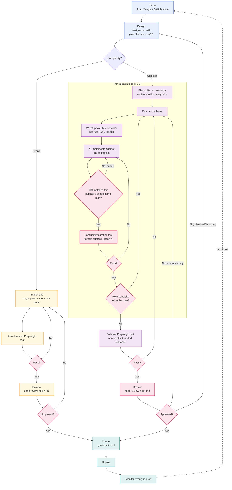

# Feature / Bug-Fix SOP

Day-to-day dev loop: ticket intake to deploy. Splits into a simple path and a
complex path right after Design — complexity decides how much structure the
implementation phase needs, not whether design/test/review happen at all.

## Reading it

- **Complexity is decided once, right after Design** — not per-subtask. If the
  plan turns out to need splitting mid-flight, that's a sign Design
  under-scoped it; treat it as a plan revision (`E8A` "plan itself is wrong"
  loops back to **B**, not around the loop).
- **Simple path**: one implementation pass, one test gate, one review gate.
  This is the default — don't route a change through the subtask loop unless
  it actually needs it.
- **Complex path — the per-subtask loop is TDD, not implement-then-check**:
  write/update that subtask's test first (`E2T`, `tdd` skill) so the AI
  iterates against a concrete red→green signal, not just "looks right."
  Check the diff against the plan (`E4`) before running the test, and only
  pull the next subtask once the current one is green. This catches scope
  drift per-subtask instead of discovering it after everything's implemented.
- **Two test gates, different speeds**: `E5` is a fast unit/integration test
  run per subtask — deliberately not Playwright, since E2E is too slow to run
  inside a tight per-subtask loop. `E7` is the one full Playwright E2E pass,
  run once after all subtasks are integrated — a subtask can pass alone and
  still break when combined with the others, so this gate exists even though
  each subtask already passed `E5`.
- **Review failure branches by cause** (`E8A`): "execution didn't match an
  otherwise-correct plan" loops back into the subtask loop; "the plan itself
  was wrong" goes all the way back to Design. Don't reflexively send every
  review rejection back to Design.
